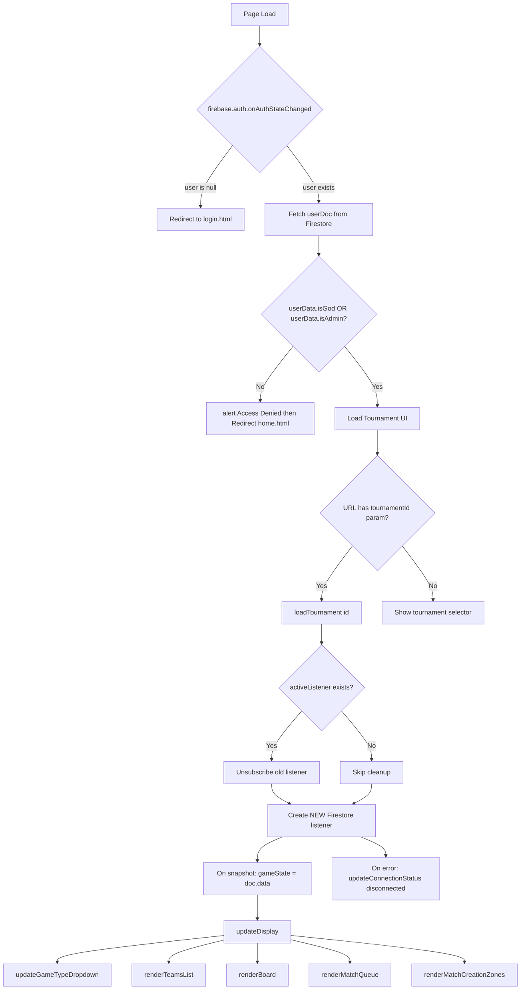
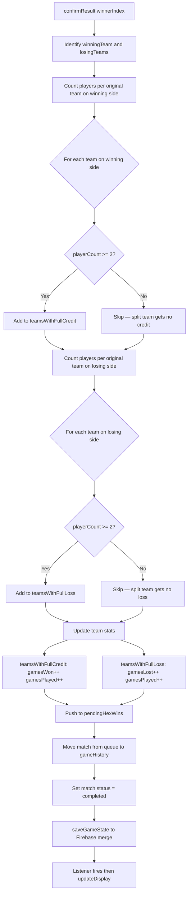
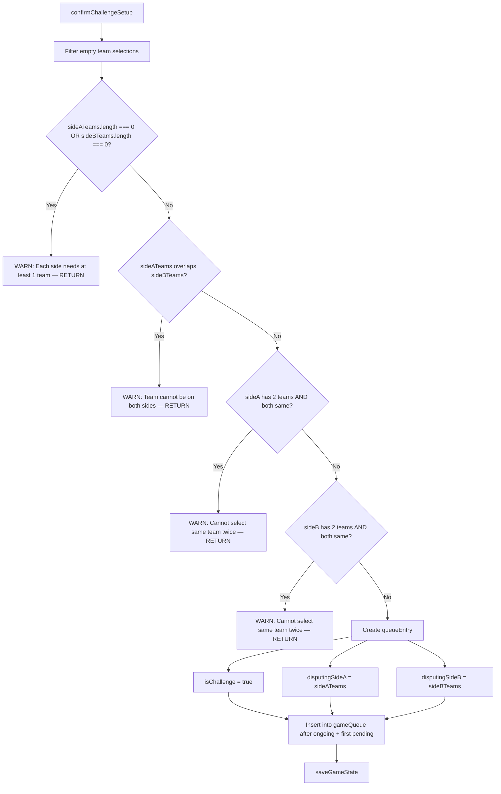
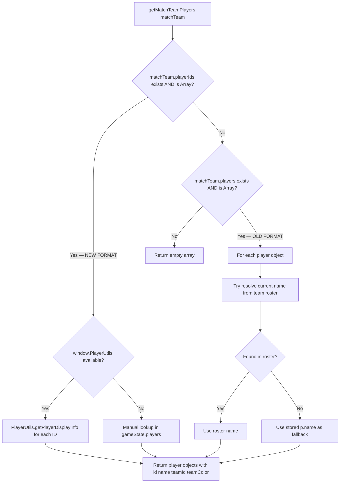
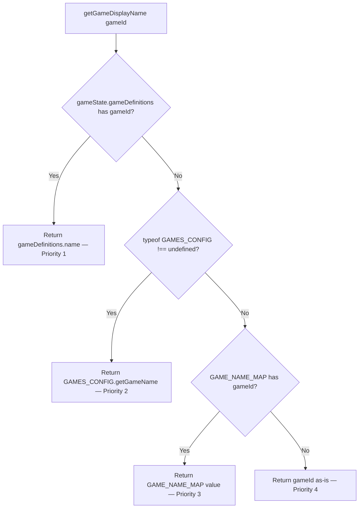
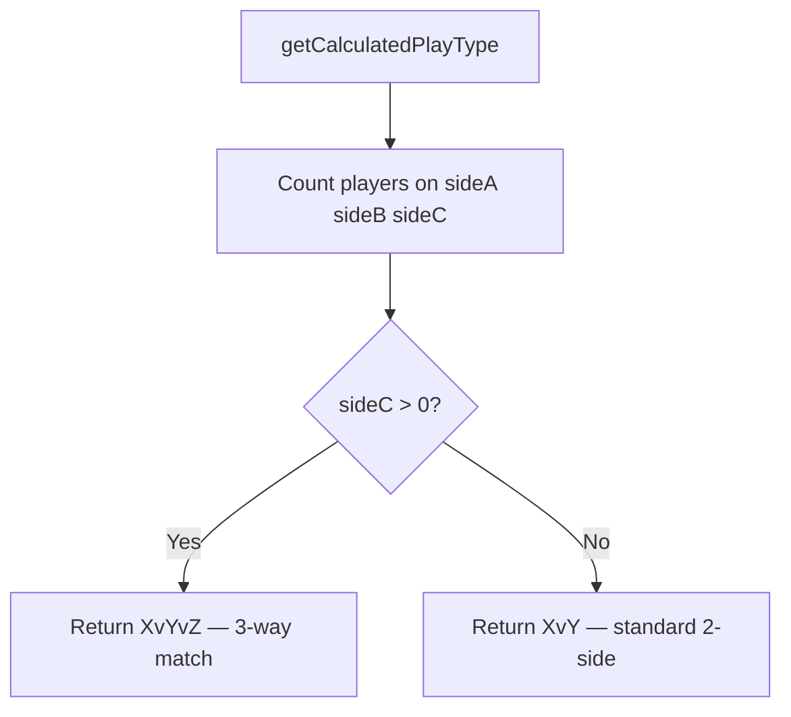
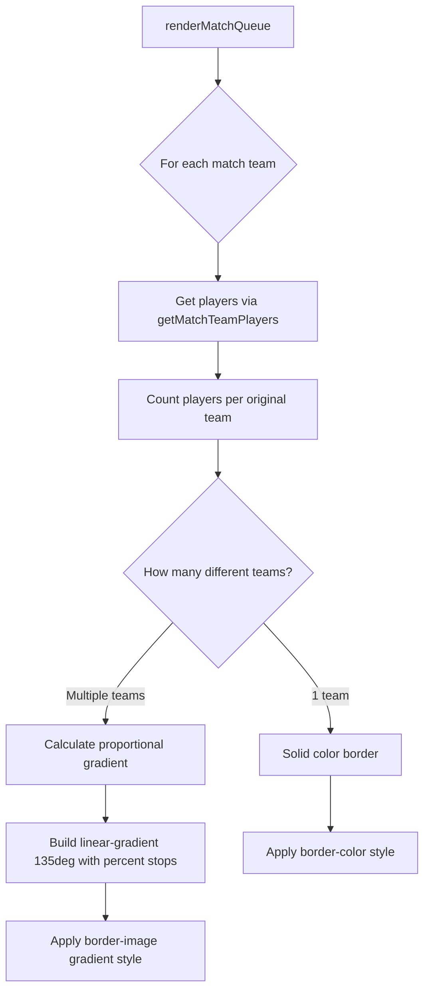
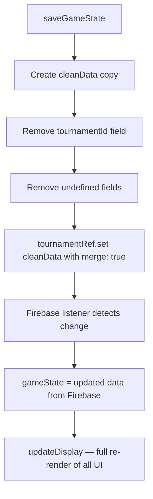

# admin.js — Logic Diagrams

> Source: `BoardGame/lightweight/scripts/admin.js`
> The command center. Auth, tournament management, match queue, scoring, board control.

## 1. Authentication & Initialization

## 2. Match Result Confirmation & Scoring

## 3. Challenge Match Validation

## 4. Player Data Format Resolution

## 5. Game Display Name Resolution

## 6. Player Format Detection

## 7. Match Queue Color Logic

## 8. Firebase Save Pattern

