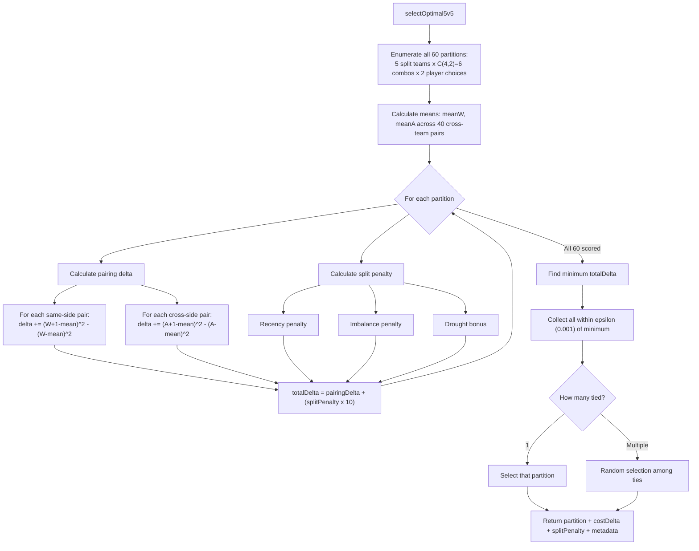
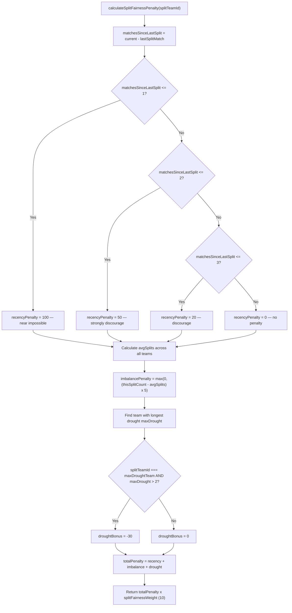
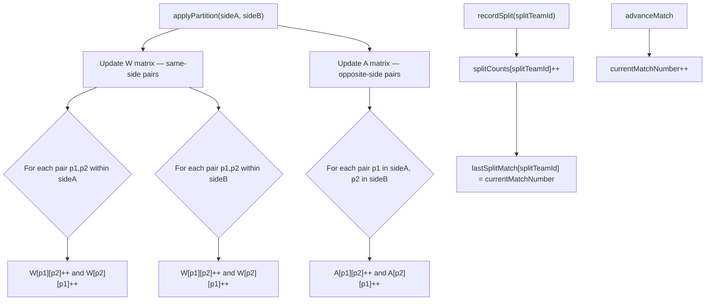
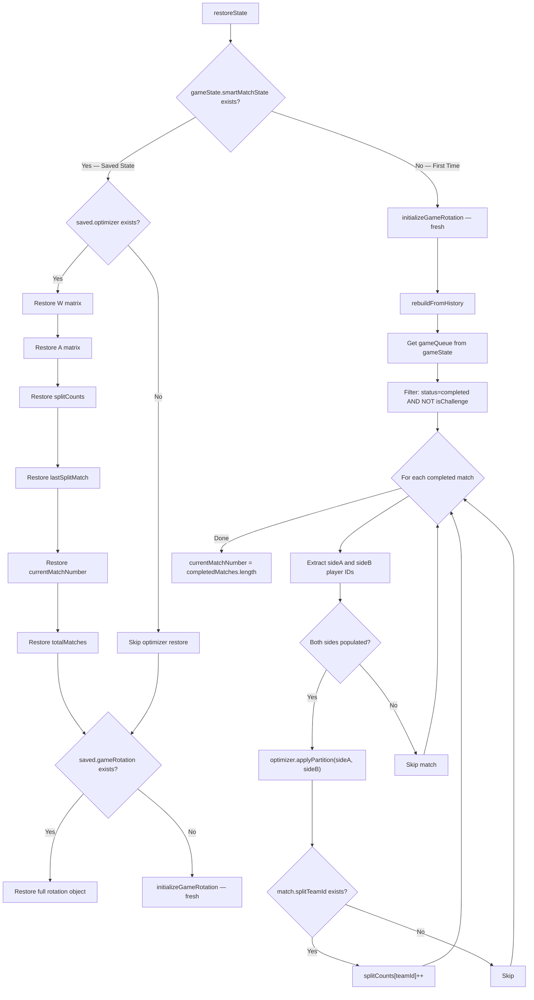
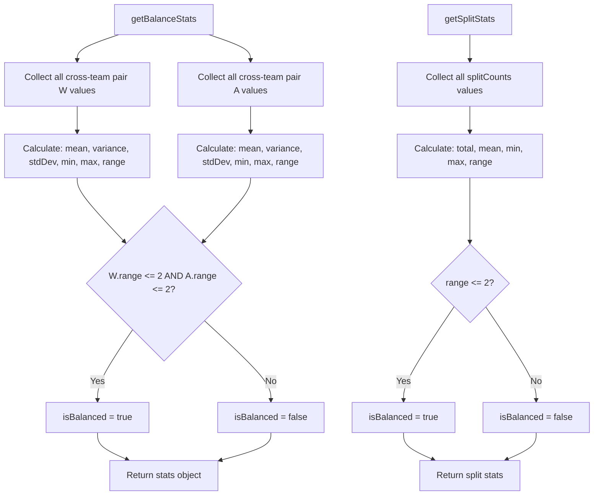

# balance-optimizer.js — Logic Diagrams

> Source: `BoardGame/scripts/balance-optimizer.js`
> Math engine: greedy variance minimization, W/A matrices, split fairness penalties.
> Cost function: `C = Sum[(W_ij - meanW)^2 + (A_ij - meanA)^2]` across 40 cross-team pairs.

## 1. Selection Algorithm (5v5)

## 2. Split Fairness Penalty

## 3. Matrix Updates

## 4. State Restoration

## 5. Statistics Output

