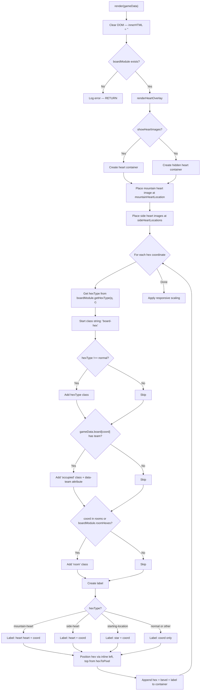
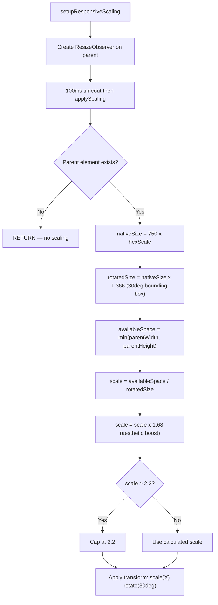
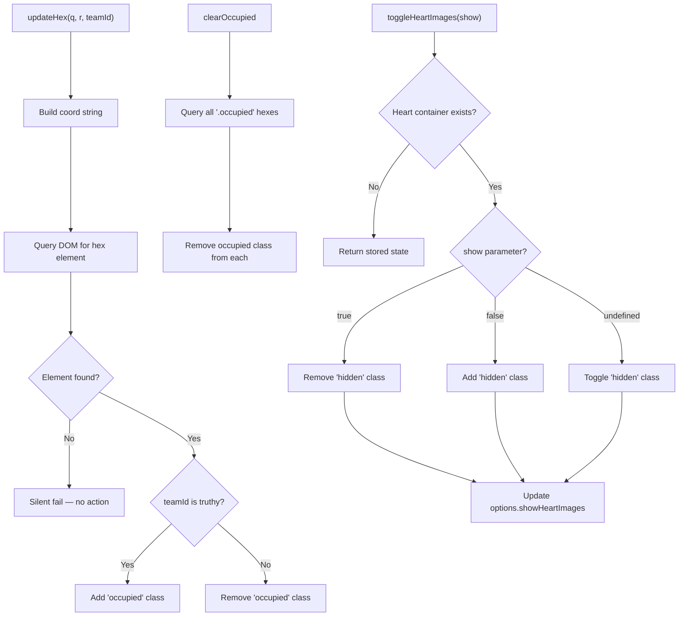

# board-renderer.js — Logic Diagrams

> Source: `BoardGame/shared/scripts/board-renderer.js`
> Hex grid visualization with responsive scaling, heart overlays, and incremental updates.
> Pure rendering layer — delegates coordinate math to external `boardModule`.

## 1. Render Pipeline

## 2. Responsive Scaling

## 3. Incremental Updates

