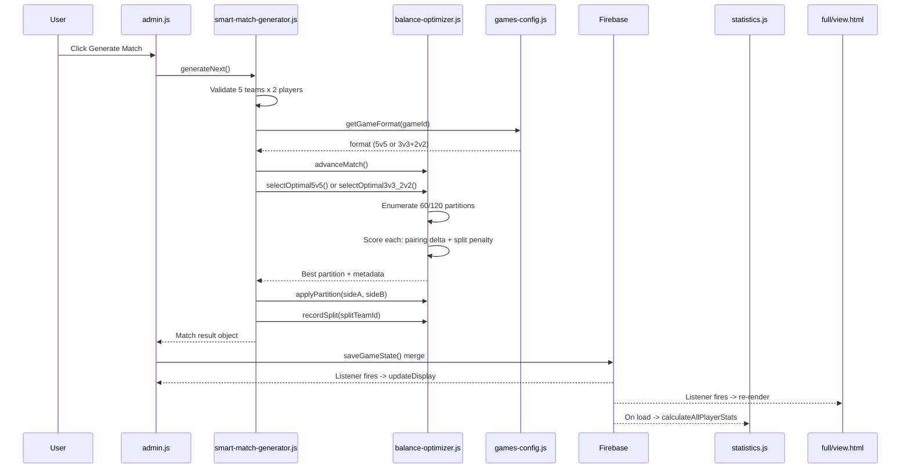
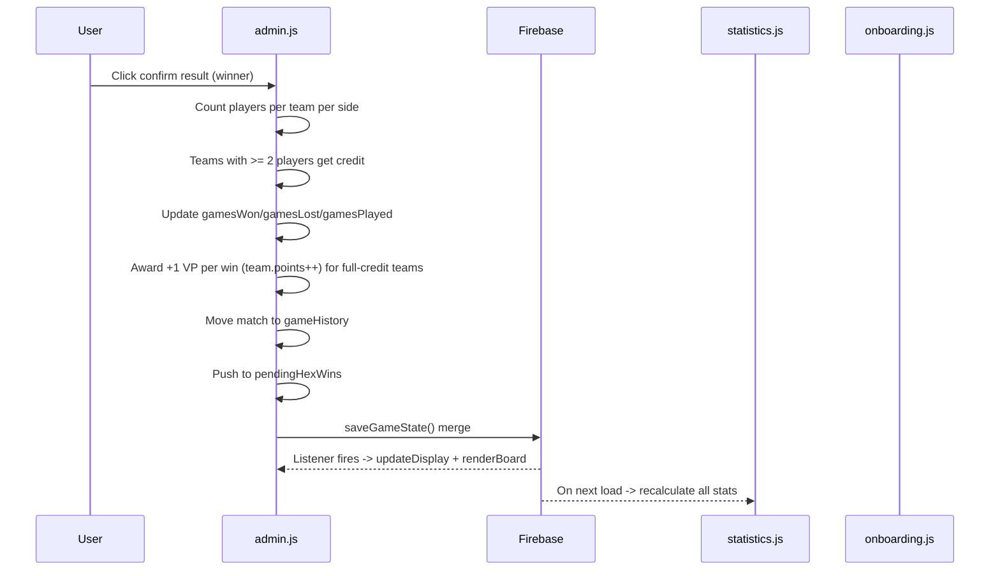
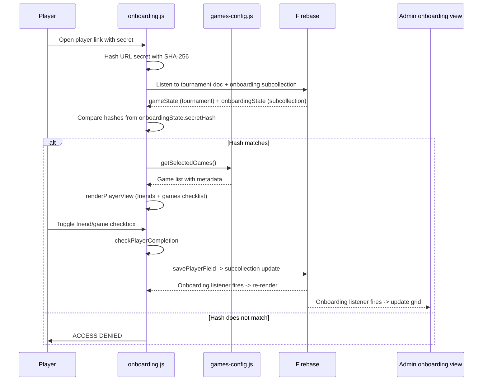
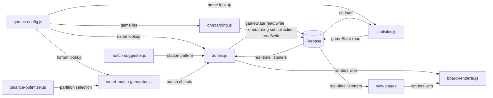
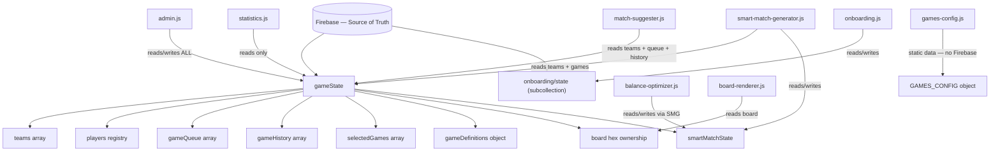

# Cross-System Data Flow

> How all JS modules interact end-to-end.

## 1. Match Generation Sequence

## 2. Match Result Flow

## 3. Onboarding Flow

## 4. Data Dependency Graph

## 5. State Ownership

