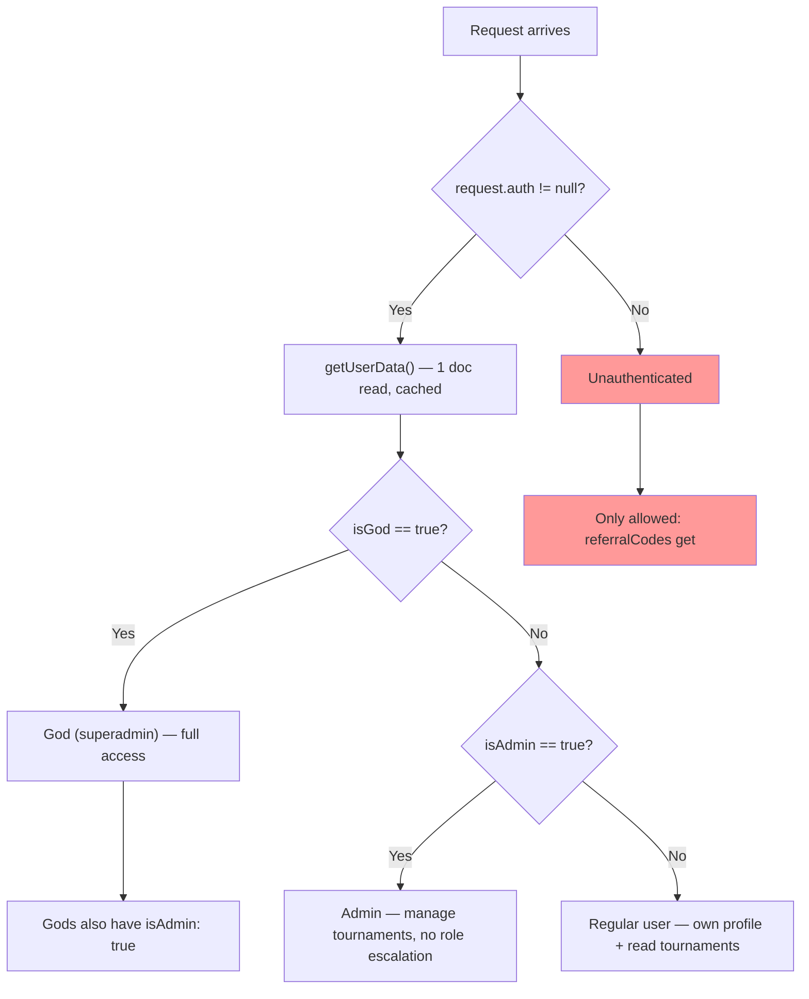
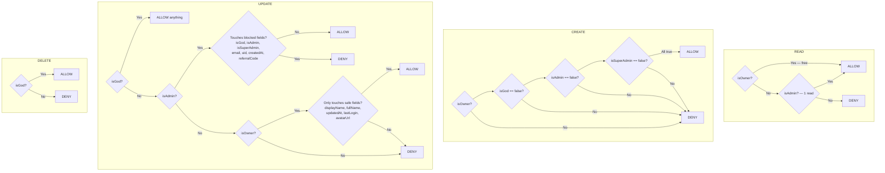
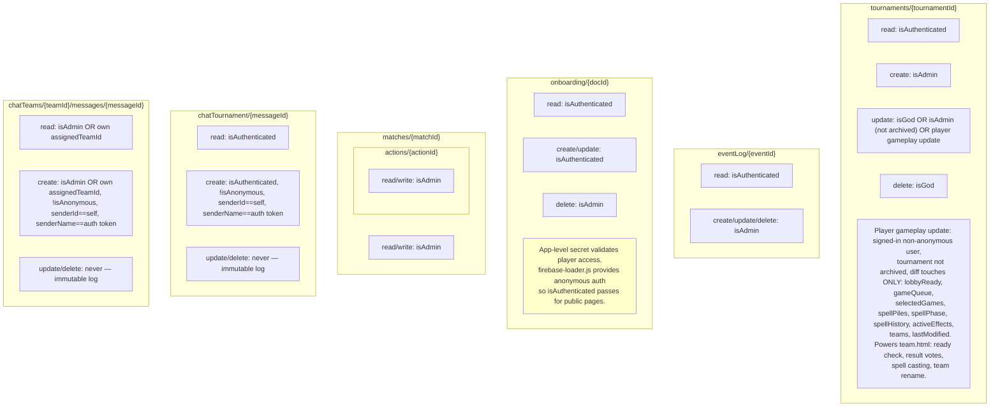
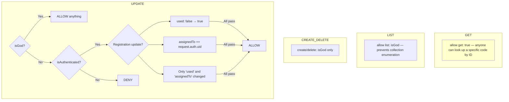
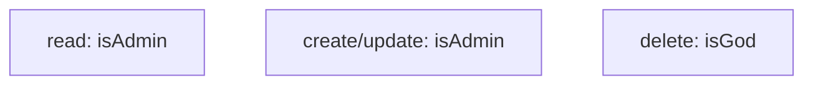

# firestore.rules — Security Rules Architecture

> Source: `BoardGame/firestore.rules`
> Firestore security rules controlling read/write access per collection.
> Last updated: July 2026

## 1. Role Hierarchy



## 2. Users Collection — `users/{userId}`



## 3. Tournaments & Subcollections



## 4. Referral Codes — `referralCodes/{code}`



## 5. Global Action Log — `actionLog/{logId}`



## 6. Permission Matrix Summary

```
Collection              | Unauth | Anon Auth | User (owner) | Admin | God
------------------------|--------|-----------|--------------|-------|----
users (own doc)         |   -    |     -     |   R C U      | R U   | CRUD
users (other doc)       |   -    |     -     |    -         | R U*  | CRUD
tournaments             |   -    |    R      |    R U‡      | CRU   | CRUD
  eventLog              |   -    |    R      |    R         | CRUD  | CRUD
  onboarding            |   -    |   CRU     |   CRU        | CRUD  | CRUD
  matches               |   -    |     -     |    -         | CRUD  | CRUD
    actions             |   -    |     -     |    -         | CRUD  | CRUD
  chatTournament          |   -    |    R      |    R         | CR    | CR
  chatTeams (own team)    |   -    |     -     |    R C       | R C†  | R C
referralCodes (get)     |  R**   |    R      |    R         | R     | CRUD
referralCodes (list)    |   -    |     -     |    -         |  -    | R
referralCodes (update)  |   -    |   U***    |   U***       | -     | CRUD
actionLog               |   -    |     -     |    -         | CRU   | CRUD

*   Admin blocked from: isGod, isAdmin, isSuperAdmin, email, uid, createdAt, referralCode
**  Get only (single doc by ID) — list denied
*** Registration update only: used false→true, assignedTo==self, no extra fields
†   Admin/God bypass the assignedTeamId check and can read/post in any team's chat.
‡   Gameplay fields only (lobbyReady, gameQueue, selectedGames, spellPiles,
    spellPhase, spellHistory, activeEffects, teams, lastModified), and only
    while the tournament is not archived. Non-anonymous auth required.
```

## 7. Known Trade-offs

| Issue | Severity | Rationale |
|---|---|---|
| Players can write gameplay fields of any tournament | Low | Field-level whitelisting is the limit of Firestore rules for a single doc — per-team ownership inside `lobbyReady`/`gameQueue`/`spellPiles` can't be expressed. Team membership is enforced client-side; the admin confirms all match results, and votes are advisory until admin approval. Acceptable for a friendly-scale tournament. |
| Onboarding writable by any authenticated user | Low | Firestore rules are document-level — can't restrict per-player fields. URL secret + anonymous auth provides app-level control. |
| User create requires explicit `false` for role fields | Minor | `null == false` is `false` in rules. Client must set all three role flags explicitly. Defense-in-depth. |
| Referral codes readable by ID without auth | Accepted | Registration flow validates code before Firebase Auth user exists. 8-char entropy (~2.8 trillion) makes guessing impractical. Collection listing is blocked. |

## 8. Billing Cost Notes

- `isAuthenticated()` and `isOwner()` — free (no doc reads)
- `isAdmin()` and `isGod()` — 1 doc read each (cached within single evaluation)
- Firestore caches `get()` results, so multiple calls to `getUserData()` in one rule evaluation cost only 1 read
- Rules are ordered cheap checks first (`isOwner` before `isAdmin`) to minimize reads
