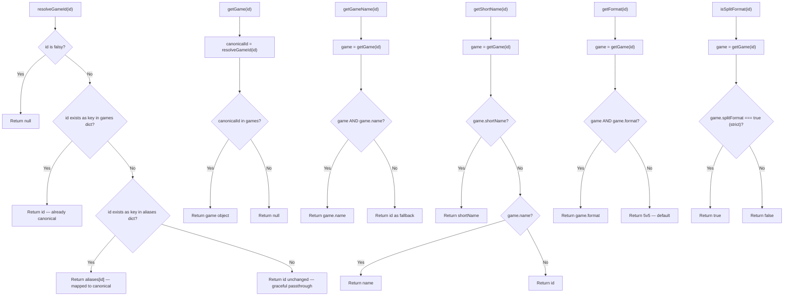
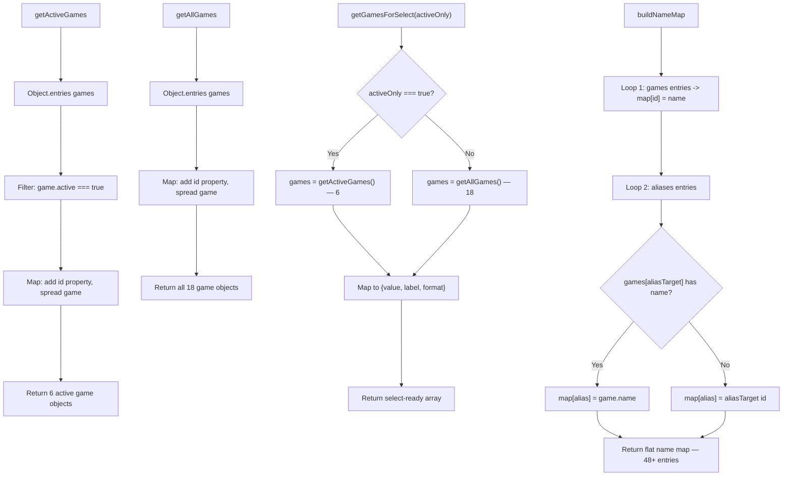

# games-config.js — Logic Diagrams

> Source: `BoardGame/shared/scripts/games-config.js`
> Master catalog: 18 games, 48+ aliases, 10 helper methods.
> Single source of truth for game definitions.

## 1. Resolution & Lookup Chain

## 2. Filtering & Export

## Game Data Reference

| ID | Name | Format | Split | Active |
|---|---|---|---|---|
| predecessor | Predecessor | 5v5 | No | Yes |
| aoe4 | Age of Empires IV | 3v3+2v2 | Yes | Yes |
| overwatch2 | Overwatch 2 | 5v5 | No | Yes |
| cs2 | Counter-Strike 2 | 5v5 | No | Yes |
| wc3 | Warcraft 3 | 3v3+2v2 | Yes | Yes |
| cod | Call of Duty | 5v5 | No | Yes |
| spellbreak | Spellbreak | 5v5 | No | No |
| spacemarine2 | Space Marine 2 | 5v5 | No | No |
| dow2 | Dawn of War 2 | 3v3+2v2 | Yes | No |
| sc2 | StarCraft II | 3v3+2v2 | Yes | No |
| valorant | Valorant | 5v5 | No | No |
| dota2 | Dota 2 | 5v5 | No | No |
| hearthstone | Hearthstone | 1v1 | No | No |
| rocketleague | Rocket League | 3v3 | No | No |
| tekken8 | Tekken 8 | 1v1 | No | No |
| beerdrinking | Beer Drinking | FFA | No | No |
