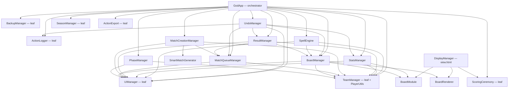
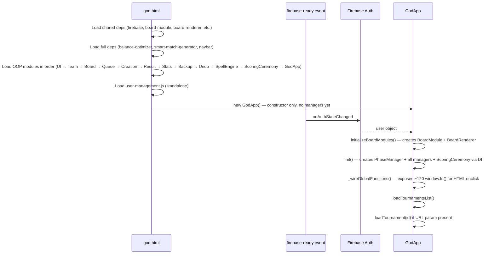
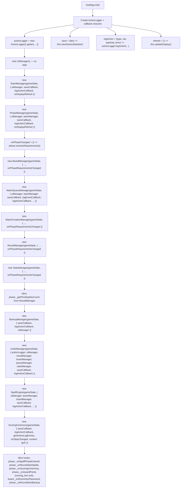
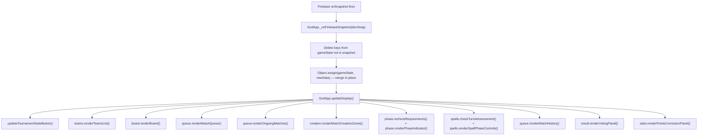
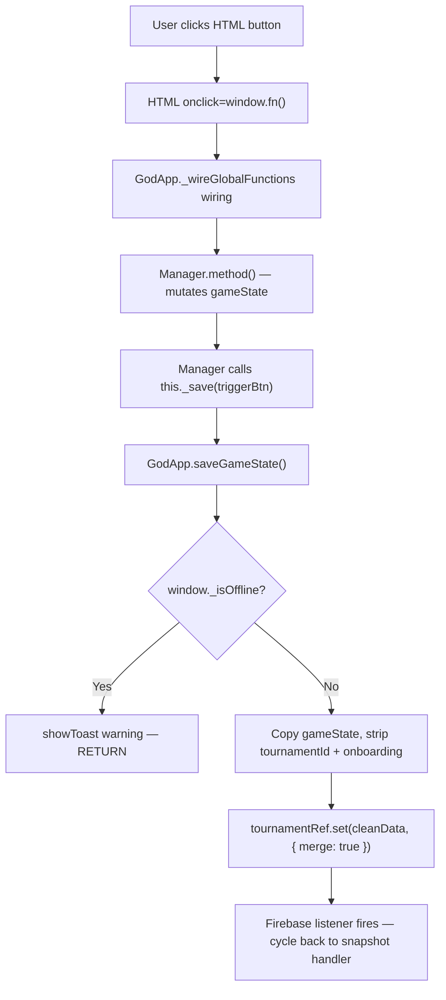

# God Mode OOP Modules — Logic Diagrams

> Source: `BoardGame/full/scripts/` (19 modules)
> Replaces the monolithic `god-scripts.js` with dependency-injected ES6 classes.
> Last updated: March 2026

## 1. Module Overview

| Module | File | Role | Dependencies |
|---|---|---|---|
| ActionLogger | `full/scripts/action-logger.js` | Structured action logging to Firestore subcollection, real-time listener, query API, undo tracking | None (leaf — receives getters via constructor) |
| UIManager | `full/scripts/ui-manager.js` | Status messages, game log, connection monitoring, visual effects panel | None (leaf) |
| TeamManager | `full/scripts/team-manager.js` | Team/player CRUD, colors, seating order, player resolution | UIManager, PlayerUtils |
| PhaseManager | `full/scripts/phase-manager.js` | Tournament phase state machine, requirements validation, phase indicator UI, break insertion | UIManager, TeamManager |
| BoardManager | `full/scripts/board-manager.js` | Hex board rendering, click handling, team assignment, rooms, plates, points, win condition | BoardModule, BoardRenderer, UIManager, TeamManager |
| MatchQueueManager | `full/scripts/match-queue-manager.js` | Queue rendering, drag-reorder, match start, break management, persistent numbering | UIManager, TeamManager |
| MatchCreationManager | `full/scripts/match-creation-manager.js` | Drag-drop match creation, challenges, mass import, editing, auto-generation, game catalog | UIManager, TeamManager, MatchQueueManager, SmartMatchGenerator |
| ResultManager | `full/scripts/result-manager.js` | Match result confirmation, quick-confirm popup, game history, pending hex notifications, instant VP award on win | UIManager, TeamManager, MatchQueueManager, BoardManager |
| StatsManager | `full/scripts/stats-manager.js` | Statistics recalculation, point awarding, round advancement, points correction UI | BoardModule, UIManager, TeamManager |
| BackupManager | `full/scripts/backup-manager.js` | Tournament snapshots to Firestore subcollection, auto-backup on round start, restore with pre-restore safety backup | None (leaf — receives callbacks via constructor) |
| UndoManager | `full/scripts/undo-manager.js` | Reverse logged actions using previousState snapshots, preview changes, mark entries undone in Firestore | ActionLogger, UIManager, ResultManager, BoardManager, MatchQueueManager, StatsManager |
| SpellEngine | `full/scripts/spell-engine.js` | Spell definitions, draw piles, spell phase turns, effect handlers, conditions, admin UI | UIManager, TeamManager, BoardManager |
| ScoringCeremony | `full/scripts/scoring-ceremony.js` | Animated step-by-step scoring walkthrough, plays during scoring_vp phase (round 2+), driven by god.html, rendered on view.html via ceremonyState | None (leaf — receives callbacks via constructor) |
| DisplayManager | `full/scripts/display-manager.js` | Smart display engine for view.html (v2) — renders lightweight-quality 1920×1080 layout (dual arena, territory map, queue, results, score strip), phase-aware display modes with auto-rotation, ceremony overlay | BoardModule, BoardRenderer, ScoringCeremony (static renderStep), GAMES_CONFIG, PlayerUtils |
| ReplayEngine | `full/scripts/replay-engine.js` | Backup-anchored forward replay, state reconstruction at any action, playback controls | None (leaf — reads Firestore directly, used by replay.html) |
| SummaryGenerator | `full/scripts/summary-generator.js` | Post-tournament analytics: overview, team stats, key moments, hex analysis, round summaries | BoardModule (optional) |
| ActionExport | `full/scripts/action-export.js` | JSON/CSV export of action log entries | ActionLogger (static describeAction) |
| SeasonManager | `full/scripts/season-manager.js` | Tournament season CRUD, tournament-season linking, seasons list rendering, edit/create modals | None (leaf — receives getters via constructor) |
| GodApp | `full/scripts/god-app.js` | Orchestrator: creates all managers + ActionLogger + PhaseManager + SpellEngine + BackupManager + UndoManager + ScoringCeremony + ActionExport + SeasonManager, Firebase listener, save/load, window globals, tab access control | All of the above |

## 2. Dependency Graph



**Note:** ActionLogger is not injected directly into managers. Instead, GodApp creates a `logAction` closure and passes it as `logActionCallback` to all managers via DI. This avoids coupling managers to ActionLogger.

## 3. Initialization Sequence



## 4. Dependency Injection Pattern



Every manager receives the **same `gameState` object reference**. Mutations happen in-place; no manager ever replaces the reference.

## 5. Data Flow — Firebase Snapshot to UI



## 6. Data Flow — User Action to Firebase



## 7. Window Global Wiring

`GodApp._wireGlobalFunctions()` exposes methods from every manager as `window.*` functions for HTML onclick attributes. Grouped by module:

| Module | Globals count | Examples |
|---|---|---|
| UIManager | 3 | `showStatus`, `addLog`, `clearLog` |
| TeamManager | 14 | `getTeamColor`, `openPlayerManager`, `updateTeamName`, `openSeatingOrder` |
| PhaseManager | 12 | `advancePhase`, `forceAdvancePhase`, `confirmForceAdvance`, `closeForceAdvanceModal`, `getCurrentPhase`, `getPhaseRequirements`, `insertBreak`, `endBreak`, `endTournament`, `forceAllReady`, `beginSpells`, `loopBack` |
| BoardManager | 4 | `assignTeamToHex`, `toggleRoomHex`, `closeTeamPicker`, `highlightValidPlacements` |
| MatchQueueManager | 14 | `startMatch`, `removeFromQueue`, `dragQueueItem`, `addBreakToQueue`, `confirmClearQueue` |
| MatchCreationManager | 24 | `dragTeam`, `dropToSide`, `addMatchToQueue`, `confirmChallengeSetup`, `generateSuggestedMatches`, `openGameManager` |
| ResultManager | 8 | `openQuickConfirm`, `closeResultConfirm`, `quickConfirmResult`, `openCorrectResultModal`, `closeCorrectResultModal`, `selectCorrectedWinner`, `confirmCorrectResult`, `acceptVotedResult`, `overrideVotedResult` |
| StatsManager | 6 | `recalculateTeamStats`, `advanceRound`, `closeNextRoundModal`, `confirmAdvanceRound`, `adjustPointsWithReason`, `setTeamPointsWithReason` |
| BackupManager | 3 | `createManualBackup`, `refreshBackups`, `restoreFromBackup` |
| UndoManager | 3 | `openUndoConfirmModal`, `closeUndoConfirmModal`, `confirmUndoAction` |
| SpellEngine | 12 | `loadAllSpells`, `updateTeamSpellInventory`, `distributeSpellToTeam`, `distributeRandomSpells`, `filterSpells`, `initializeSpellPiles`, `removeSpellFromTeam`, `showSpellPreview`, `removeActiveEffect`, `skipSpellTurn`, `forceEndSpellPhase` |
| ActionLogger | 3 | `startActivityLogListener`, `stopActivityLogListener`, `loadMoreActivityLog` |
| ScoringCeremony | 3 | `pauseCeremony`, `resumeCeremony`, `skipCeremony` |
| Display Controls | 3 | `setDisplayOverride`, `setRotationInterval`, `clearDisplayOverride` |
| Replay & Export | 3 | `openReplayWindow`, `exportActionLogJSON`, `exportActionLogCSV` |
| GodApp | 8 | `onTournamentSelect`, `saveGameState`, `exportGameState`, `logout` |

Additionally: `window.gameState` is exposed via `Object.defineProperty` (getter returns `app.gameState`, setter uses `Object.assign`) for backward compatibility with `user-management.js`.

## 8. Shared State Contract

```mermaid
graph TD
    GS["gameState (single mutable object)"]

    GS --> teams["teams[] — team roster, colors, stats"]
    GS --> players["players{} — normalized player registry"]
    GS --> gameQueue["gameQueue[] — pending + ongoing matches"]
    GS --> gameHistory["gameHistory[] — completed matches"]
    GS --> board["board{} — hex coord → team ownership"]
    GS --> rooms["rooms[] — room hex coordinates"]
    GS --> selectedGames["selectedGames[] — active game IDs"]
    GS --> gameDefinitions["gameDefinitions{} — custom game metadata"]
    GS --> smartMatchState["smartMatchState{} — rotation counters"]
    GS --> seatingOrder["seatingOrder[] — physical seat mapping"]
    GS --> currentRound["currentRound — round number"]
    GS --> status["status — setup|playing|finished|archived"]
    GS --> currentPhase["currentPhase{} — phase name, roundNumber, startedAt"]
    GS --> lobbyReady["lobbyReady{} — per-player ready status (uid → {gameLobby, discord, gameLobbyAt, discordAt, teamId, name})"]
    GS --> breakSettings["breakSettings{} — interval, roundsSinceLastBreak, lastBreakAt"]
    GS --> broadcastMessage["broadcastMessage{} — admin broadcast text for view.html"]
    GS --> spellDefinitions["spellDefinitions{} — cached spell card metadata"]
    GS --> spellPiles["spellPiles{} — per-team drawPile/hand/usedPile"]
    GS --> spellPhase["spellPhase{} — isActive, turnOrder, currentTeamIndex, teamsCompleted"]
    GS --> activeEffects["activeEffects[] — active spell conditions/buffs"]
    GS --> spellHistory["spellHistory[] — cast spell log"]
    GS --> ceremonyState["ceremonyState{} — isActive, roundNumber, currentStepIndex, currentStep, isPaused, totalSteps"]
    GS --> displayOverride["displayOverride{} — mode, rotationInterval, forcedSlideIndex"]
    GS --> pointsHistory["pointsHistory[] — per-round hex territory points log"]

    PM[PhaseManager] -->|reads/writes| currentPhase
    PM -->|reads/writes| lobbyReady
    PM -->|reads| status
    PM -->|reads| teams
    PM -->|reads| rooms
    PM -->|reads| gameQueue
    TM[TeamManager] -->|reads/writes| teams
    TM -->|reads/writes| players
    TM -->|reads/writes| seatingOrder
    BM[BoardManager] -->|reads/writes| board
    BM -->|reads/writes| rooms
    QM[MatchQueueManager] -->|reads/writes| gameQueue
    CM[MatchCreationManager] -->|reads/writes| gameQueue
    CM -->|reads| selectedGames
    CM -->|reads| gameDefinitions
    RM[ResultManager] -->|reads/writes| gameQueue
    RM -->|reads/writes| gameHistory
    RM -->|reads/writes| teams
    SM[StatsManager] -->|reads/writes| teams
    SM -->|reads/writes| currentRound
    SM -->|reads| board
    SM -->|reads| gameHistory
    SE[SpellEngine] -->|reads/writes| spellDefinitions
    SE -->|reads/writes| spellPiles
    SE -->|reads/writes| spellPhase
    SE -->|reads/writes| activeEffects
    SE -->|reads/writes| spellHistory
    PM -->|reads| spellPhase
    SC2[ScoringCeremony] -->|reads/writes| ceremonyState
    DM2[DisplayManager] -->|reads| ceremonyState
    DM2 -->|reads| displayOverride
```



## 9. Script Loading Order (god.html)

```
1. Shared deps
   ├── firebase-loader.js, config.js
   ├── board-module.js, board-renderer.js
   ├── match-suggester.js, games-config.js
   ├── player-utils.js, toast.js

2. Full-version deps
   ├── balance-optimizer.js, smart-match-generator.js
   ├── navbar.js

3. OOP modules (order matters — each may reference prior classes)
   ├── action-logger.js          ← Phase 0B
   ├── ui-manager.js
   ├── team-manager.js
   ├── phase-manager.js          ← Phase 1
   ├── board-manager.js
   ├── match-queue-manager.js
   ├── match-creation-manager.js
   ├── result-manager.js
   ├── stats-manager.js
   ├── backup-manager.js          ← Phase 2
   ├── undo-manager.js            ← Phase 2
   ├── spell-engine.js            ← Phase 1 Weeks 8-9
   ├── scoring-ceremony.js        ← Phase 3
   ├── action-export.js           ← Phase 4
   ├── season-manager.js          ← Season system
   └── god-app.js

4. Standalone
   └── user-management.js (reads window.gameState)
```

## 10. Deprecated Files

None remain. `full/scripts/` used to keep 5 pre-OOP files around with a `_deprecated` suffix for reference (`god-scripts_deprecated.js`, `tournament-manager_deprecated.js`, `action-history_deprecated.js`, `spell-manager_deprecated.js`, `spells-god_deprecated.js`) — all confirmed to have zero live references and deleted during the 2026-07-31 cleanup pass. Their functionality lives entirely in the OOP module stack described elsewhere in this document.

## Action Logger — Firestore Subcollection

```
/tournaments/{tournamentId}/actionLog/{logId}
{
  sequenceNumber: N,                     // Monotonically increasing (atomic transaction)
  timestamp: serverTimestamp,
  actor: { type, userId, displayName },
  actionType: "match_result_confirmed",  // See action types in ROADMAP_v5.md
  category: "match"|"board"|"spell"|"points"|"phase"|"admin",
  payload: { ... },                      // Action-specific data
  previousState: { ... } | null,        // For undo
  roundNumber: N,
  phaseAtTime: "playing",
  undone: false,
  undoneBy: null,
  undoneAt: null
}
```

The `actionLogSequence` counter lives on the tournament document and is incremented atomically via a Firestore transaction each time `logAction()` is called.

## Key Design Decisions

- **No build tools**: ES6 classes in regular `<script>` tags, exposed via `window.ClassName`. No imports/exports, no bundler.
- **Shared mutable gameState**: Single object reference shared by all managers. Firebase snapshots merge via `Object.assign` — never replace the reference.
- **Callback-based cross-cutting**: `save`, `logEvent`, `onDisplayRefresh` are passed as closures, not direct module references. This avoids circular dependencies.
- **Window global wiring**: All HTML onclick handlers call `window.fn()`. GodApp wires these once during `init()`. This is the only place managers are coupled to the DOM event model.
- **Constructor DI**: Every manager receives `gameState` as first arg and a deps object as second. No managers import or reference each other by global name.

## Phase Flow (Current)

The tournament phase state machine uses 16 phases with loops and optional spell windows.

### Round Flow
```
scoring_vp → scoring_hex → hex_placement_1 → spell_window_1 → hex_placement_2
→ challenges → spell_window_2 → challenge_game → spell_window_3
  (loop → challenge_game, max 7×) → board_resolved → spell_window_4
  (loop → challenges) → matches_in_progress → round_advance → (loop)
```

### Match Slots (Match 1 / Match 2 run concurrently)
- `matches_in_progress` replaced the old six linear phases (`match_1_setup → match_1_lobby → match_1_playing → match_2_setup → match_2_lobby → match_2_playing`). Match 1 and Match 2 don't share players, so there's no reason to force one to fully finish before the other can even start — they now progress independently.
- State: `gameState.currentPhase.slots = { 1: subPhase, 2: subPhase }`, each `subPhase` one of `SLOT_SUB_PHASES = ['setup', 'lobby', 'playing', 'done']`. Initialized to `{1:'setup', 2:'setup'}` on entering `matches_in_progress`.
- `PhaseManager.advanceSlot(slot, force)` moves ONE slot forward; `getSlotSubPhase(slot)`, `getSlotDisplayInfo(slot)`, `getSlotRequirements(slot)` read/gate that slot only. `getSlotRequirements` filters `gameQueue` by `entry.slot === slot` (untagged entries count for either slot).
- The outer phase's requirements (`_calculateRequirements('matches_in_progress')`) are simply "both slots done" — `round_advance` only becomes reachable once `bothSlotsDone()` is true, regardless of which slot finished first.
- Queue entries need an explicit `slot` tag since there's no longer a single "current phase" to infer it from — `admin-improved-adapter.js` tracks an admin-selected `_targetSlot` (see "Set Target" button on each match slot card) instead of inferring it from `_computeCurrentSlot()`.
- Break mid-round preserves both slots' progress: `insertBreak()`/`_autoInsertBreak()` stash `currentPhase.slots` as `returnSlots`; `endBreak()` restores it exactly.
- UI: `phase-manager.js`'s `renderPhaseIndicator()` (god.html) and `admin-improved-adapter.js`'s `_renderMatchSlotCards()` (admin.html) each render two side-by-side cards, one per slot, with their own guidance/action button — instead of one bar showing whichever slot the old linear phase pointed at.

### Auto-Advance
- `AUTO_ADVANCE_PHASES = ['round_advance']` — immediate auto-advance (loops to scoring_vp)
- `AUTO_ADVANCE_WHEN_MET = []` — no longer used for lobby readiness (see below); kept as an empty extension point.
- Per-slot lobby auto-advance now lives in `PhaseManager.recheckRequirements()`: each slot independently auto-advances its own `lobby → playing` once `getSlotRequirements(slot)` is met, guarded by `_autoAdvanceSlot1Pending`/`_autoAdvanceSlot2Pending` (mirrors the old single `_autoAdvancePending` guard, just one per slot).

### Points System
- **Victory points (VP)**: Awarded instantly in `ResultManager.confirmResult()` when a non-challenge match result is confirmed (+1 VP per win for teams with full credit). `confirmCorrectResult()` reverses/re-awards VP on correction.
- **Hex territory points**: Awarded when leaving `scoring_hex` via `_onAwardPoints` hook (wired in GodApp). `awardRoundPoints()` scans `heartHexControl` — side hearts = +1, mountain hearts = +2.
- **scoring_vp phase**: Pure review/ceremony phase — VPs already awarded on match result confirmation. `_onScoringCeremony` hook fires here (round 2+).
- **scoring_hex phase**: Admin reviews hex state; hex territory points awarded on exit (round 2+).
- **Contested hex freeze**: `awardRoundPoints()` skips heart hexes with `challengeHexCoord` matching a pending/ongoing challenge match.

### Lobby Readiness (per match slot)
- **Two-status readiness**: `gameState.lobbyReady = { [playerUid]: { gameLobby, discord, gameLobbyAt, discordAt, teamId, name } }`. Both must be `true` per player. Legacy `ready: true` treated as both met.
- **Discord channel auto-assignment**: `assignDiscordAndLobby(entries)` in admin.js assigns channels #1-#5 to match sides and designates lobby creators. Stored on match doc as `discordChannels` + `lobbyCreators`.
- **Phase requirements**: Two separate pills — "Game lobby: X/Y" and "Discord: X/Y" — computed per slot by `getSlotRequirements(slot)`, counting only that slot's players (`_getPlayersWhoMustReadyForSlot(slot)`). Both must be fully met for that slot's auto-advance.
- **Reset on entry**: `_resetLobbyReadyForSlot(slot)` clears only that slot's players' entries when it enters `lobby` — the other slot's entries are untouched, since it may already be mid-lobby or mid-play.
- **Team.html two-button UI**: Players see per-match Discord channel assignment, lobby creator role, and two buttons. Each writes independently via `tournamentRef.update({ ['lobbyReady.<uid>.<status>']: true })`. `team-controls.js` determines which slot's lobby state to show via `_getMyActiveSlot()` (finds the queue entry tagged with our team that isn't completed yet).
- **Admin override**: `forceAllReadyForSlot(slot)` marks that slot's required players as ready (both statuses); wired as `window.forceAllReady(slot)`.

### Spell Windows (spell_window_1 through spell_window_4)
- Optional phases — admin can begin spell casting (`beginSpells()`) or skip by advancing.
- If spellPhase.isActive, requirements track team turn completion.
- Loop-back from `spell_window_3 → challenge_game` (max 7 games per round) and `spell_window_4 → challenges`.

### Challenge Game Loop
- `LOOP_TARGETS = { spell_window_3: 'challenge_game', spell_window_4: 'challenges' }`
- `MAX_CHALLENGE_GAMES = 7` — blocks looping after 7 challenge games per round
- `challengeGamesPlayed` counter on `currentPhase` tracks count, reset on new round

### Break Interval System
- **Firestore field**: `gameState.breakSettings = { intervalRounds: 2, roundsSinceLastBreak: 0, lastBreakAt: null }`
- `roundsSinceLastBreak` incremented on `round_advance` exit.
- `_isBreakDue()` checks `roundsSinceLastBreak >= intervalRounds`.
- When advancing TO `matches_in_progress`, if break is due: `_autoInsertBreak('matches_in_progress')` inserts break with `returnToPhase` and `autoInserted: true` flag. A manual break taken mid-round (either slot already progressing) additionally stashes `currentPhase.slots` as `returnSlots` so `endBreak()` resumes both slots exactly where they were.
- Counter resets to 0 in `endBreak()`.
- Break settings modal in god.html: configure interval, reset counter, skip next break.
- Break interval badge in phase indicator: shows `⏸ 1/2` counter.
- Action types: `break_auto_inserted`, `break_settings_changed`, `break_skipped`.

### Legacy Phase Migration
- `migratePhaseIfNeeded()` converts old phase names on load: `round_start → scoring_vp`, `challenge_selection → challenges`, `pre_game_instructions → match_1_setup`, `lobby_ready → match_1_lobby`, `scoring_and_placement → scoring_vp`, `spell_phase → spell_window_1`, `round_end → round_advance`.
- The six old per-slot linear names (`match_1_setup`, `match_1_lobby`, `match_1_playing`, `match_2_setup`, `match_2_lobby`, `match_2_playing`) collapse onto `matches_in_progress` + a `slots` object reflecting where the tournament actually was (e.g. `match_1_playing` → `{1:'playing', 2:'setup'}`).
- An ancient, pre-slot-tracking `matches_in_progress` phase name (from before the six-phase split even existed) happens to collide with the current name — told apart only by the absence of a `slots` object, in which case `slots` is backfilled as `{1:'playing', 2:'setup'}`.

### Broadcast Message
- Admin can send text from god.html/admin.html shown as cyan banner on view.html. Stored as `gameState.broadcastMessage = { text, sentAt, sentBy }`.

### Additional Window Globals (Phase Flow)
| Module | Globals |
|---|---|
| PhaseManager | `openBreakSettings`, `closeBreakSettings`, `saveBreakSettings`, `resetBreakCounter`, `skipNextBreak`, `beginSpells`, `loopBack` |
| GodApp | `setBroadcastMessage`, `clearBroadcastMessage` |

## Phase 2: Admin Power — Edit, Correct, Undo

### Enhanced previousState Capture
- All ~50 `logAction()` calls now pass meaningful previousState snapshots (were mostly `null`)
- Pattern: capture snapshot BEFORE mutation, pass to `logAction()` after mutation
- Enables the undo system to reverse any logged action

### Match History Display
- `MatchQueueManager.renderMatchHistory(containerId)` — renders completed + ongoing + pending matches in reverse chronological order
- "All Matches" panel in Matches tab with status filter dropdown and search input
- Completed items show green border, winner badge, "Correct Result" and "Edit" buttons
- `openEditMatchModal()` redirects completed matches to Correct Result modal

### Result Correction
- `ResultManager.openCorrectResultModal(matchId)` — renders team selection for changing winner
- `confirmCorrectResult()` reverses old winner stats (gamesWon, gamesLost, gamesPlayed, points/VP), applies new winner stats + VP, updates queue entry + history entry
- Corrected matches marked with `corrected: true`, `originalWinner` preserved
- Action type: `match_result_corrected`

### Points Correction
- `StatsManager.renderPointsCorrectionPanel()` — per-team row with color dot, +/- buttons, direct input, reason field
- `adjustPointsWithReason(teamId, delta, reason)` and `setTeamPointsWithReason(teamId, value, reason)` — wraps point changes with logging

### Backup/Restore System
- **BackupManager** class — DI leaf module, writes to Firestore subcollection `/tournaments/{id}/backups/{backupId}`
- `createBackup(trigger, description)` — clean snapshot excluding transient fields
- `autoBackup()` — hooked to `phase._onRoundStartBackup`, fires on every `round_start`
- `restoreFromBackup(backupId)` — creates pre-restore safety backup first, then applies snapshot via `Object.assign`
- `renderBackupPanel(containerId)` — list view with trigger badges (manual/auto/pre-restore), restore buttons
- Action types: `backup_created`, `backup_restored`

### Undo System
- **UndoManager** class — receives most managers via DI for type-specific reversals
- **Undoable types**: `plate_placed`, `plate_removed`, `match_result_confirmed`, `match_started`, `match_removed`, `points_awarded`, `points_corrected`, `match_result_corrected`, `match_details_edited`
- **Non-undoable**: `phase_advanced`, `tournament_created`, `queue_cleared`, `spell_phase_started`
- `canUndo(entry)` — checks undone status, type, previousState presence
- `previewUndo(entry)` — returns `{ changes: [{field, from, to}], warnings }` for confirmation modal
- `executeUndo(entry)` — dispatches to type-specific handlers, saves, marks entry `undone: true` in Firestore, logs `action_undone`
- Undo button on each Activity Log entry (only for canUndo entries)
- Undo Confirmation modal with changes preview and warnings
- Action type: `action_undone`

### Voting Integration
- `team-controls.js` fixed to read from `gameData.gameQueue || gameData.selectedGames` (was only reading `selectedGames`)
- Vote writes use dynamic `queueField` for Firestore path compatibility
- `ResultManager.renderVotingPanel()` — per-match vote progress with accept/override buttons
- Confirmed matches are dropped from the queue and votes are shown in the confirm popup instead of a separate always-visible panel — the old "Disputed Matches" panel and `getDisputedMatches()` were removed
- Action types: `vote_accepted`, `vote_overridden`

### New Action Types (Phase 2)

| Type | Category | Description |
|------|----------|-------------|
| `match_result_corrected` | match | Result changed after completion |
| `action_undone` | admin | An action was reversed |
| `backup_created` | admin | Tournament snapshot saved |
| `backup_restored` | admin | Tournament restored from backup |
| `vote_accepted` | match | Consensus vote confirmed |
| `vote_overridden` | match | Admin overrode vote result |
