# BoardGame Tournament System — Architecture & Logic Map

> **Auto-generated from codebase analysis.**
> When you change a JS file, update the matching diagram file below.

## System Overview

```mermaid
graph TB
    subgraph Pages
        ADMIN[lightweight/admin.html]
        ADMIN2[full/admin.html]
        SETUP[lightweight/setup.html]
        ONBOARD[lightweight/onboarding.html]
        VIEW[lightweight/view.html]
        STATS[lightweight/statistics.html]
        GOD[full/god.html]
    end

    subgraph Core_JS
        ADM_JS[admin.js]
        SMG[smart-match-generator.js]
        BO[balance-optimizer.js]
        MS[match-suggester.js]
        GC[games-config.js]
        BR[board-renderer.js]
        ST[statistics.js]
        PC[platforms-config.js]
        OB[onboarding-lightweight.js]
        TOAST[toast.js]
    end

    subgraph God_Modules
        GA[god-app.js]
        AL[action-logger.js]
        UIM[ui-manager.js]
        TMM[team-manager.js]
        PMM[phase-manager.js]
        BMM[board-manager.js]
        QMM[match-queue-manager.js]
        CMM[match-creation-manager.js]
        RMM[result-manager.js]
        SMM[stats-manager.js]
        BKM[backup-manager.js]
        UDM[undo-manager.js]
        SEM[spell-engine.js]
        SCM[scoring-ceremony.js]
        SNM[season-manager.js]
        APA[admin-phase-adapter.js]
    end

    subgraph View_Modules
        DM[display-manager.js]
    end

    subgraph Replay_Modules
        REM[replay-engine.js]
        SGM[summary-generator.js]
        AEM[action-export.js]
    end

    subgraph Firebase
        FB[(Firestore DB)]
        AUTH[Firebase Auth]
        RULES[firestore.rules]
    end

    ADMIN --> ADM_JS
    ADMIN2 --> ADM_JS
    ADMIN2 -->|phase adapter| PMM
    STATS --> ST
    ONBOARD --> OB
    VIEW --> BR

    ADM_JS -->|creates matches via| SMG
    ADM_JS -->|creates matches via| MS
    SMG -->|delegates math to| BO
    SMG -->|looks up formats| GC
    MS -->|looks up games| GC
    ADM_JS -->|renders board| BR
    ADM_JS -->|looks up names| GC
    ST -->|looks up names| GC
    OB -->|looks up games| GC
    OB -->|looks up platforms| PC

    ADM_JS -->|uses| TOAST
    ST -->|uses| TOAST
    OB -->|uses| TOAST

    ADM_JS -->|read/write| FB
    ST -->|read| FB
    OB -->|read/write| FB
    ADM_JS -->|auth gate| AUTH
    OB -->|secret validation| FB
    RULES -->|enforces access| FB

    GOD --> GA
    GA --> SCM
    VIEW --> DM
    DM --> SCM
    GA --> AL
    GA --> UIM
    GA --> TMM
    GA --> PMM
    GA --> BMM
    GA --> QMM
    GA --> CMM
    GA --> RMM
    GA --> SMM
    GA --> SEM
    AL -->|write actionLog| FB
    GA -->|read/write| FB
    GA -->|auth gate| AUTH
    BMM -->|renders board| BR
    CMM -->|creates matches via| SMG

    %% firebase-loader.js provides anonymous auth fallback for all pages.
    %% Admin/setup override with real login; public pages (view, stats,
    %% onboarding) use the anonymous session to satisfy isAuthenticated rules.
```



## File Index

| Diagram File | Source JS | Diagrams | Description |
|---|---|---|---|
| [admin-lightweight.md](admin-lightweight.md) | `lightweight/scripts/admin.js` | 14 | Auth, match results, challenges, player formats, game names, queue colors, connection monitor, seating order, breaks, tournament state, points award, Discord auto-assignment |
| [smart-match-generator.md](smart-match-generator.md) | `scripts/smart-match-generator.js` | 5 | Main pipeline, 5v5 vs 3v3+2v2, rotation state machine, repeat counts |
| [balance-optimizer.md](balance-optimizer.md) | `scripts/balance-optimizer.js` | 5 | Selection algorithm, split penalty, matrix updates, state restore, stats |
| [match-suggester.md](match-suggester.md) | `scripts/match-suggester.js` | 2 | 10-match rotation pattern, fairness note |
| [games-config.md](games-config.md) | `scripts/games-config.js` | 2 | Resolution chain, filtering & export |
| [platforms-config.md](platforms-config.md) | `shared/scripts/platforms-config.js` | 1 | Platform lookup, game-platform mapping |
| [statistics.md](statistics.md) | `scripts/statistics.js` | 8 | Data pipeline, player stats, leaderboards, filters, H2H, streaks, charts |
| [onboarding-lightweight.md](onboarding-lightweight.md) | `scripts/onboarding-lightweight.js` | 5 | View routing, completion, progress grid, secret management, platform IDs |
| [board-renderer.md](board-renderer.md) | `scripts/board-renderer.js` | 3 | Render pipeline, responsive scaling, incremental updates |
| [toast.md](toast.md) | `shared/scripts/toast.js` | 3 | Toast lifecycle, connection banner state machine, button loading |
| [firestore-rules.md](firestore-rules.md) | `firestore.rules` | 6 | Role hierarchy, per-collection permissions, permission matrix, billing costs |
| [god-modules.md](god-modules.md) | `full/scripts/*.js` (19 modules) | 10 | OOP module architecture, DI graph, data flow, window globals, script loading order, action logger, phase manager (21-phase flow with loops), spell engine, backup/undo, voting, scoring ceremony, display manager, season manager, VP + hex territory points |
| [replay-analytics.md](replay-analytics.md) | `full/scripts/replay-engine.js`, `summary-generator.js`, `action-export.js` | 9 | Replay engine architecture, state reconstruction, playback, summary generator, action export, god.html integration |
| [cross-system.md](cross-system.md) | All files | 1 | End-to-end data flow sequence diagram |

## How to Update

1. Change a JS file
2. Open the matching `.md` file from the table above
3. Update only the affected diagram(s)
4. Each diagram is a standalone ```` ```mermaid ```` block — edit in place

## Conventions

- Decision nodes use `{question?}` diamond syntax
- Guard clauses that return early are labeled with `RETURN`
- Firebase operations are marked explicitly
- Known bugs/issues are highlighted with `fill:#ff9999` where applicable
- State machines use `stateDiagram-v2` syntax
- Cross-file interactions use `sequenceDiagram` syntax
