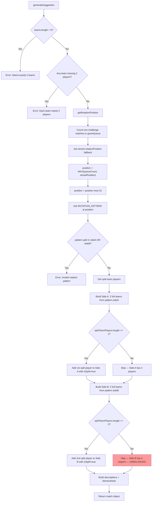
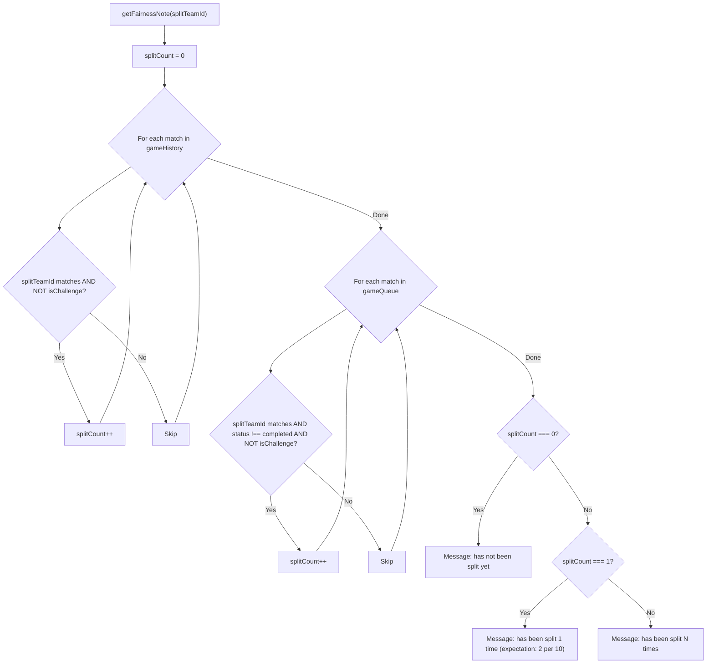
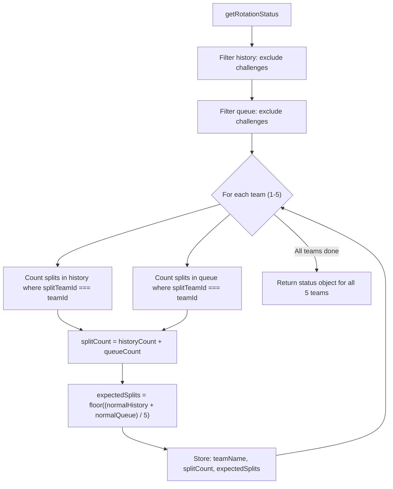

# match-suggester.js — Logic Diagrams

> Source: `BoardGame/shared/scripts/match-suggester.js`
> 10-match rotation pattern with fairness guarantees.
> Each team split exactly 2 times per 10-match cycle.

## 1. Rotation Pattern & Match Generation

## 2. Fairness Note Calculation

## 3. Rotation Status Report

