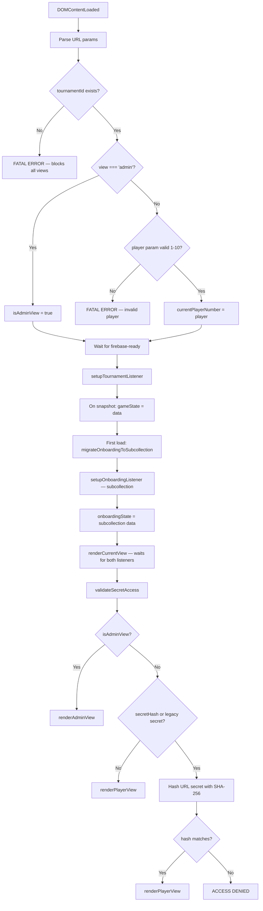
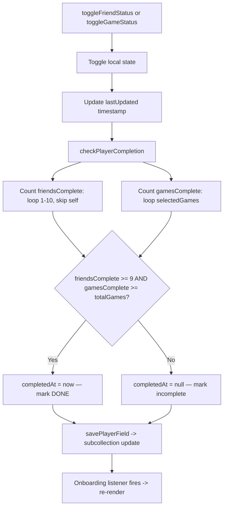
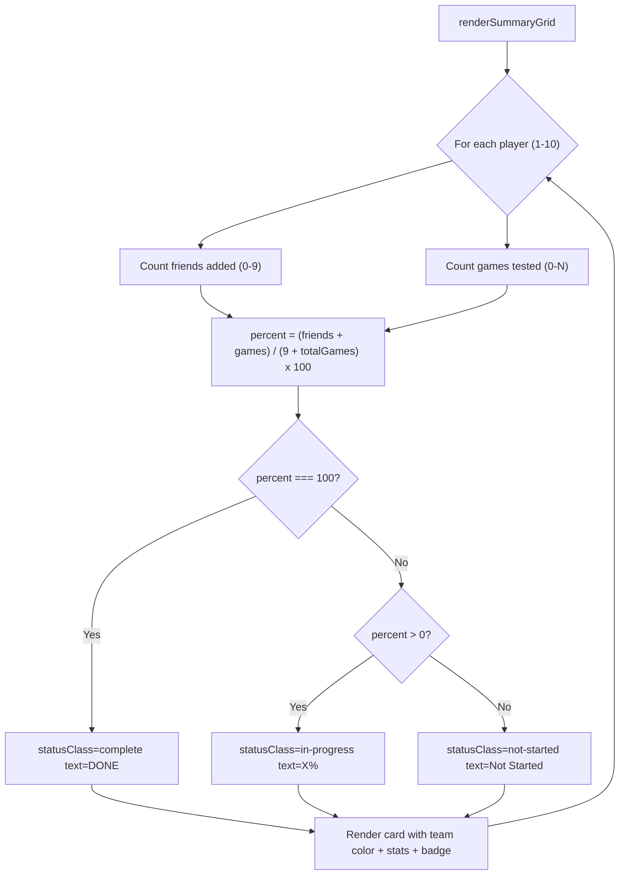
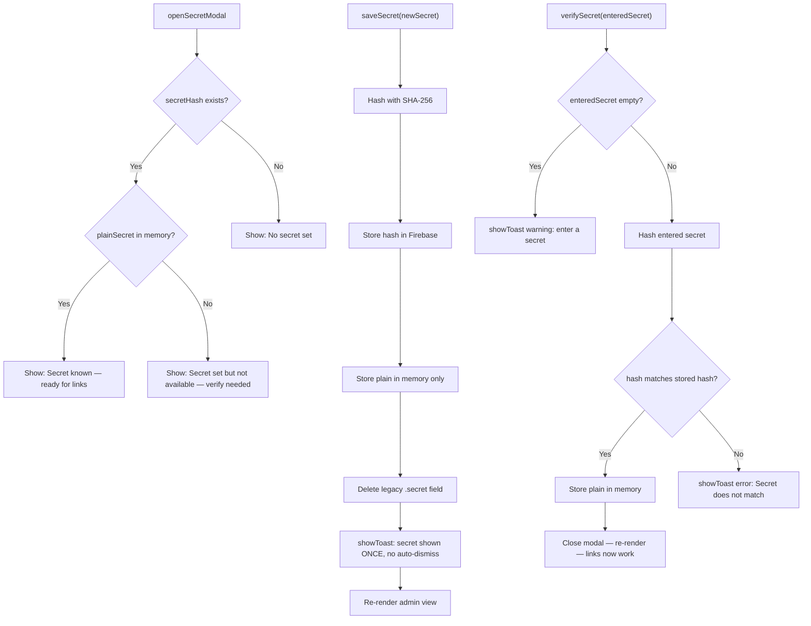
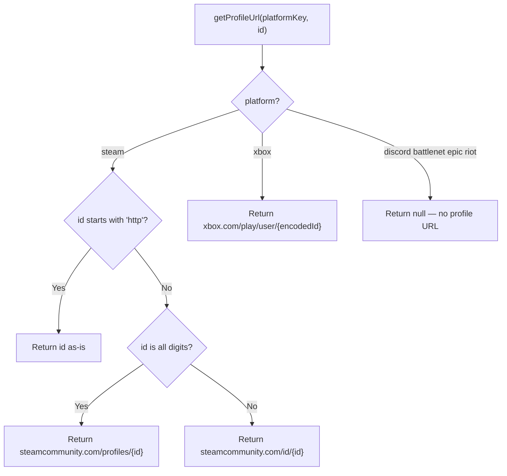
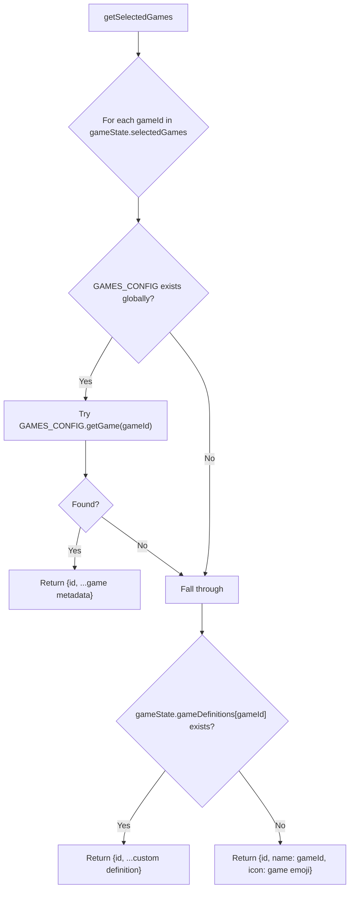

# onboarding-lightweight.js — Logic Diagrams

> Source: `BoardGame/lightweight/scripts/onboarding.js`
> Player checklist (friends + games) and admin progress dashboard.
> SHA-256 secret validation, platform ID management.
>
> **Data location:** `tournaments/{id}/onboarding/state` (Firestore subcollection).
> Onboarding data was migrated from the main tournament document to avoid
> triggering re-renders on unrelated pages (e.g., view_v2.html TV display).

## 1. View Routing & Secret Validation

## 2. Player Completion Algorithm

## 3. Admin Progress Grid

## 4. Secret Management

## 5. Platform ID Profile URLs

## 6. Game Resolution for Checklist

