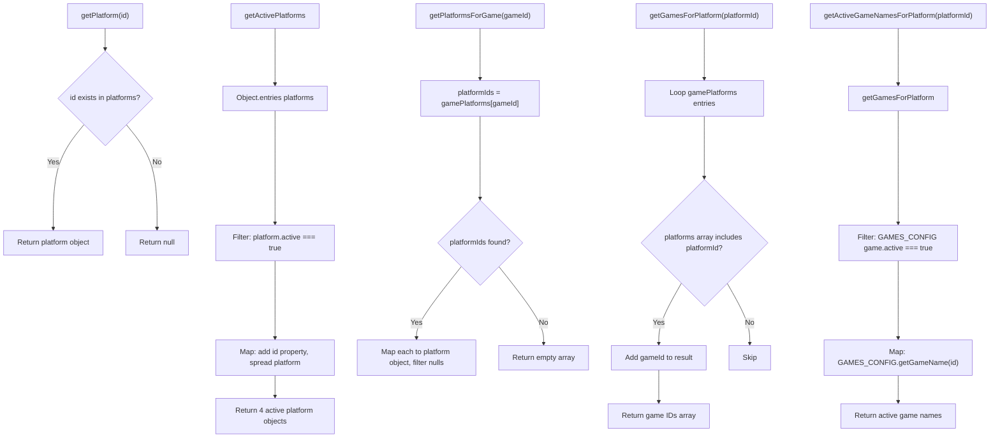

# platforms-config.js — Logic Diagrams

> Source: `shared/scripts/platforms-config.js`
> Master catalog: 6 platforms, game-platform mappings, 8 helper methods.
> Single source of truth for gaming platform definitions.

## 1. Lookup & Filtering

## Platform Data Reference

| ID | Name | Active | Games (current event) |
|---|---|---|---|
| steam | Steam | Yes | CS2, CoD, OW2, Predecessor, AoE4 |
| battlenet | Battle.net | Yes | Warcraft 3 |
| xbox | Xbox / Microsoft | Yes | AoE4 |
| discord | Discord | Yes | Voice chat |
| epic | Epic Games | No | — |
| riot | Riot Games | No | — |

## Game-Platform Mapping

| Game ID | Platforms |
|---|---|
| cs2 | steam |
| cod | steam |
| overwatch2 | steam |
| predecessor | steam |
| aoe4 | steam, xbox |
| wc3 | battlenet |
| spellbreak | epic |
| spacemarine2 | steam |
| dow2 | steam |
| sc2 | battlenet |
| valorant | riot |
| dota2 | steam |
| hearthstone | battlenet |
| rocketleague | epic |
| tekken8 | steam |
