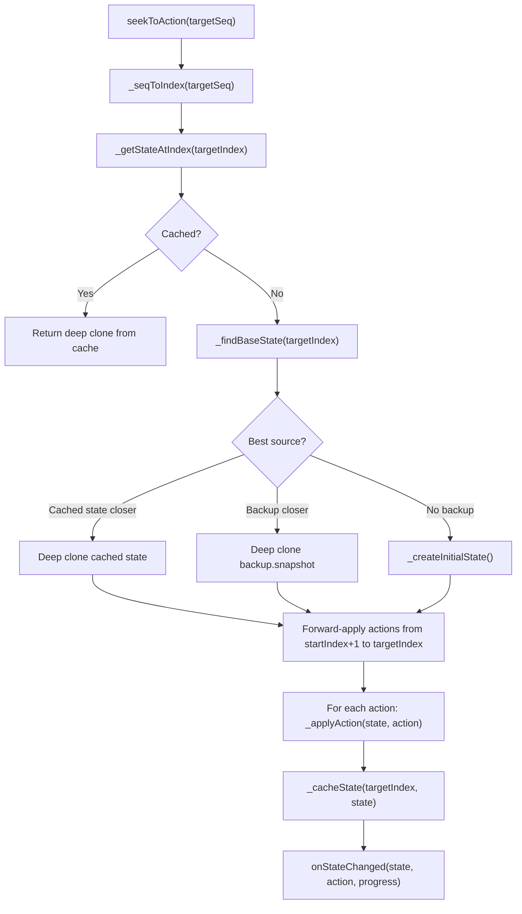
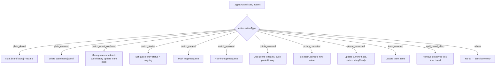
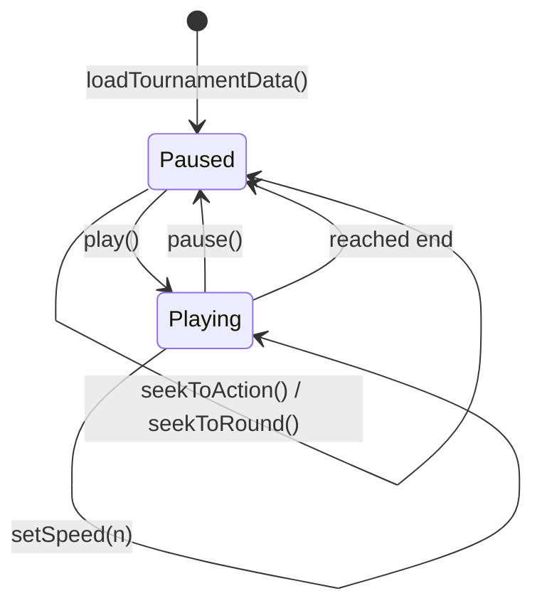
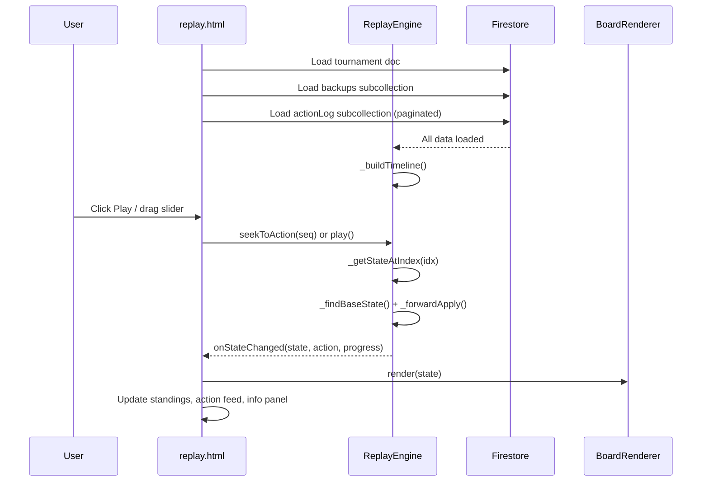
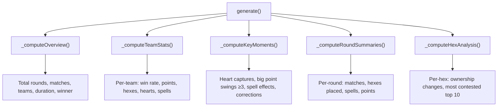

# Replay & Analytics — Logic Diagrams

> Source: `BoardGame/full/scripts/replay-engine.js`, `summary-generator.js`, `action-export.js`
> Page: `BoardGame/full/replay.html`
> Last updated: March 2026

## 1. Module Overview

| Module | File | Role | Dependencies |
|---|---|---|---|
| ReplayEngine | `full/scripts/replay-engine.js` | Backup-anchored forward replay, state reconstruction, playback controls | None (leaf — reads Firestore directly) |
| SummaryGenerator | `full/scripts/summary-generator.js` | Post-tournament analytics: overview, team stats, key moments, hex analysis | BoardModule (optional, for hex type lookups) |
| ActionExport | `full/scripts/action-export.js` | JSON/CSV export of action log entries | ActionLogger (static describeAction) |

## 2. Architecture

```mermaid
graph TD
    subgraph replay.html
        RP[replay.html page]
        RE[ReplayEngine]
        SG[SummaryGenerator]
        AE[ActionExport]
    end

    subgraph Shared
        BM[BoardModule]
        BR[BoardRenderer]
        AL[ActionLogger — static methods]
    end

    subgraph Firestore Read-Only
        TD[(Tournament Doc)]
        BK[(Backups subcollection)]
        LOG[(ActionLog subcollection)]
    end

    RP --> RE
    RP --> SG
    RP --> AE
    RP --> BM
    RP --> BR

    RE -->|loads| TD
    RE -->|loads| BK
    RE -->|loads| LOG
    RE -->|reconstructed state| BR

    SG -->|reads actions from| RE
    AE -->|loads or reuses| LOG
    AE -->|descriptions via| AL
end
```

## 3. State Reconstruction Algorithm



## 4. Forward-Apply Dispatch



## 5. Playback Controls



**Playback timing:** 1x = 1500ms/action, 2x = 750ms, 5x = 300ms, 10x = 150ms

## 6. Data Flow — replay.html



## 7. SummaryGenerator Stats



## 8. Script Loading Order (replay.html)

```
1. Shared deps
   ├── firebase-loader.js
   ├── firebase.js
   ├── board-module.js
   ├── board-renderer.js
   ├── games-config.js

2. Reused modules (static methods only)
   ├── action-logger.js    ← describeAction(), categoryBadgeClass()

3. Phase 4 modules
   ├── replay-engine.js
   ├── summary-generator.js
   └── action-export.js

4. Inline <script>
   └── Init BoardModule/Renderer, create ReplayEngine, wire callbacks
```

## 9. god.html Integration

```
GodApp._wireGlobalFunctions():
  window.openReplayWindow     → opens replay.html?tournamentId=XXX
  window.exportActionLogJSON  → ActionExport.exportJSON()
  window.exportActionLogCSV   → ActionExport.exportCSV()

god.html UI:
  Activity Log tab → "Replay" / "Action Log JSON/CSV" / "Tournament JSON/CSV" buttons
```
