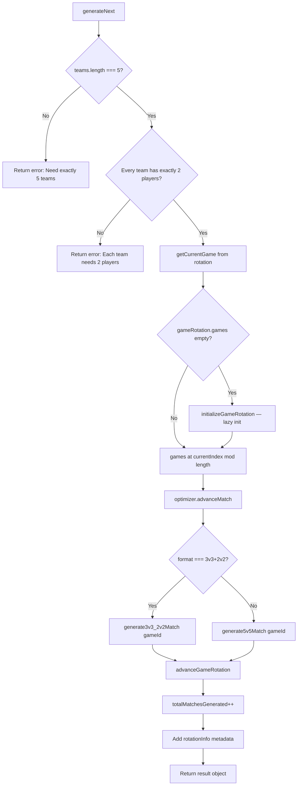
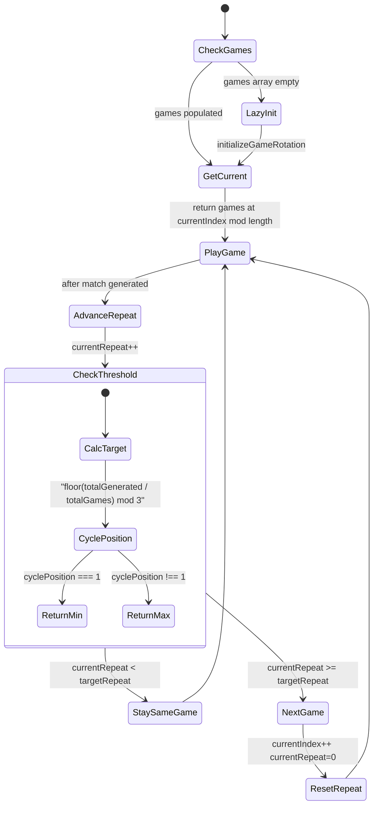
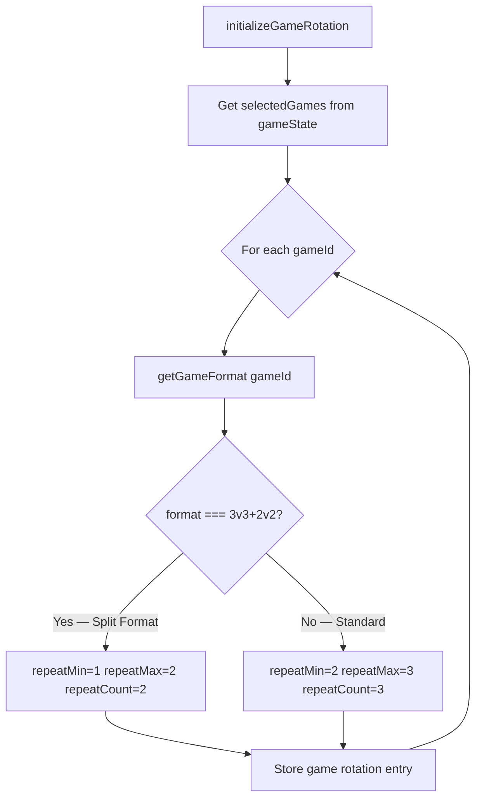
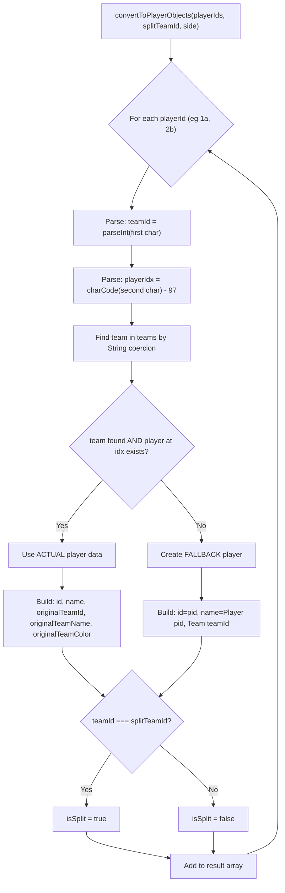
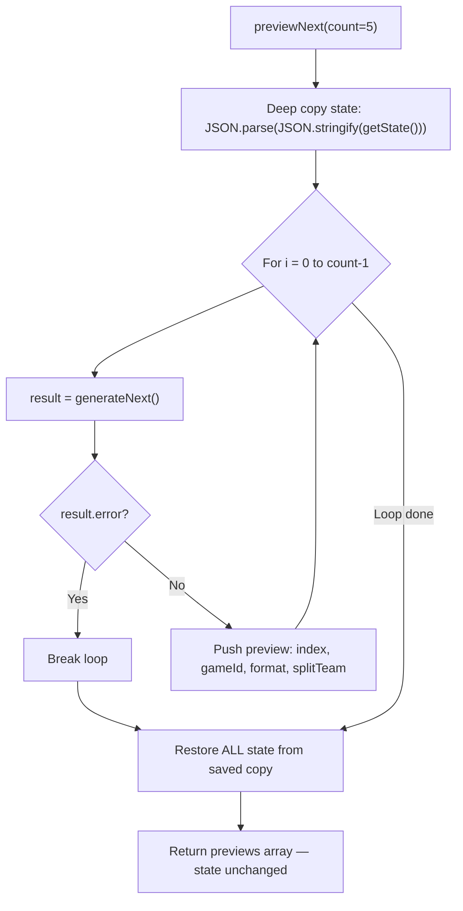

# smart-match-generator.js — Logic Diagrams

> Source: `BoardGame/shared/scripts/smart-match-generator.js`
> Orchestrator: format routing, game rotation state machine, preview system.
> Delegates math to `balance-optimizer.js`.
> Note: `rebuildFromHistory()` excludes challenges AND breaks from match counts.

## 1. Main Generation Pipeline

## 2. 5v5 vs 3v3+2v2 Match Generation

```mermaid
flowchart TD
    subgraph generate5v5Match
        A1[generate5v5Match] --> B1[optimizer.selectOptimal5v5]
        B1 --> C1[Get partition: sideA sideB splitTeam]
        C1 --> D1[optimizer.applyPartition sideA sideB]
        D1 --> E1[optimizer.recordSplit splitTeam]
        E1 --> F1["totalMatches 5v5 ++"]
        F1 --> G1[convertToPlayerObjects for both sides]
        G1 --> H1[Return 1 match object]
    end

    subgraph generate3v3_2v2Match
        A2[generate3v3_2v2Match] --> B2[optimizer.selectOptimal3v3_2v2]
        B2 --> C2[Get partition: match3v3 + match2v2]
        C2 --> D2[optimizer.applyPartition 3v3 sides]
        D2 --> E2[optimizer.applyPartition 2v2 sides]
        E2 --> F2[optimizer.recordSplit splitTeam — 3v3 only]
        F2 --> G2["totalMatches 3v3++ AND 2v2++"]
        G2 --> H2[convertToPlayerObjects for all 4 sides]
        H2 --> I2[Return 2 match objects isSimultaneous=true]
    end
```

## 3. Game Rotation State Machine

## 4. Format-Aware Repeat Counts

## 5. Player Object Conversion

## 6. Preview System — Non-Destructive

