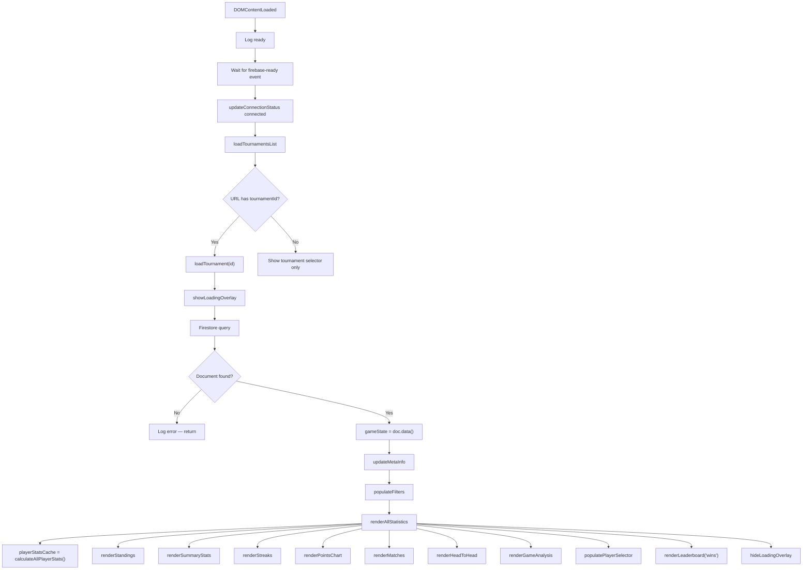
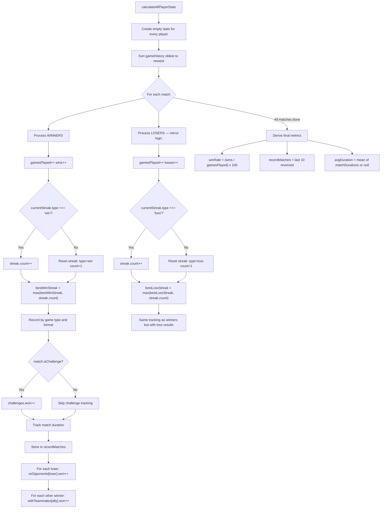
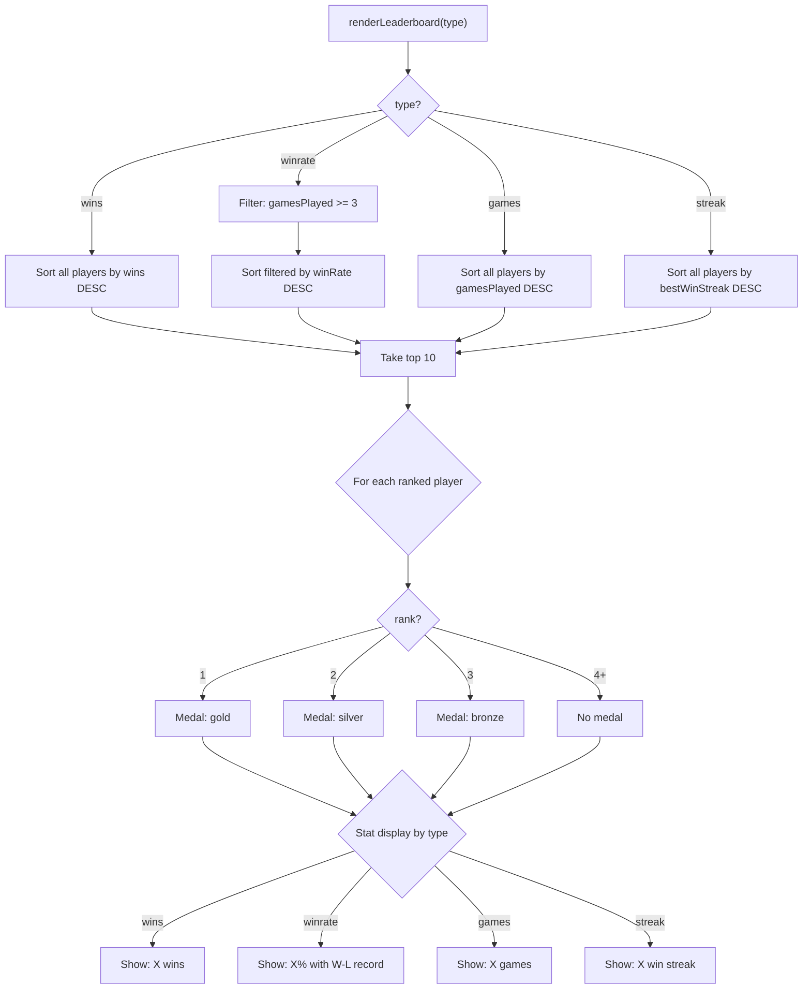
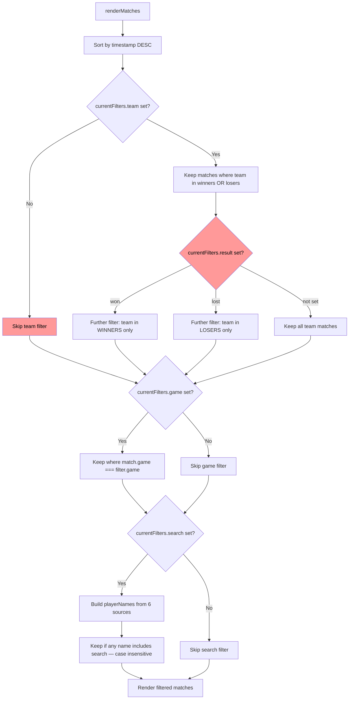
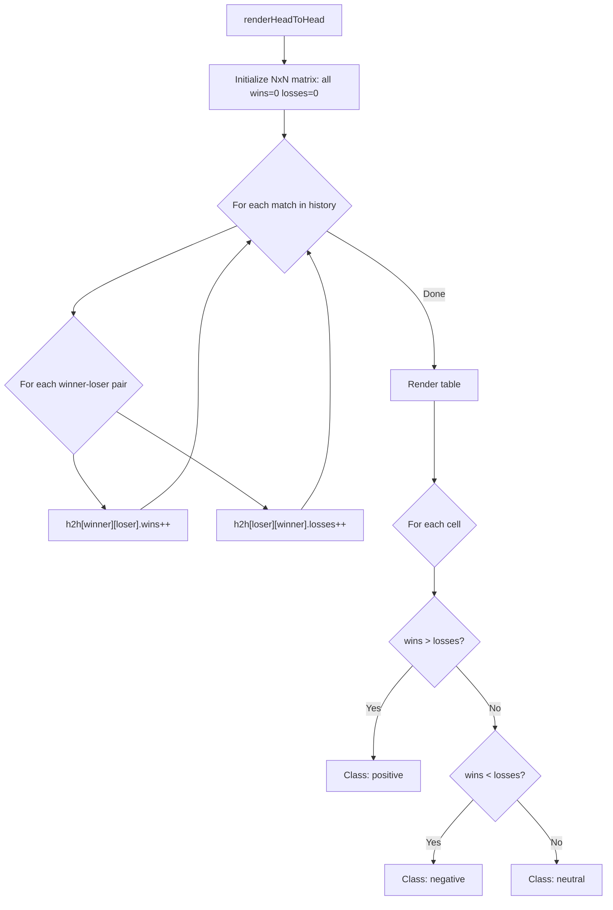
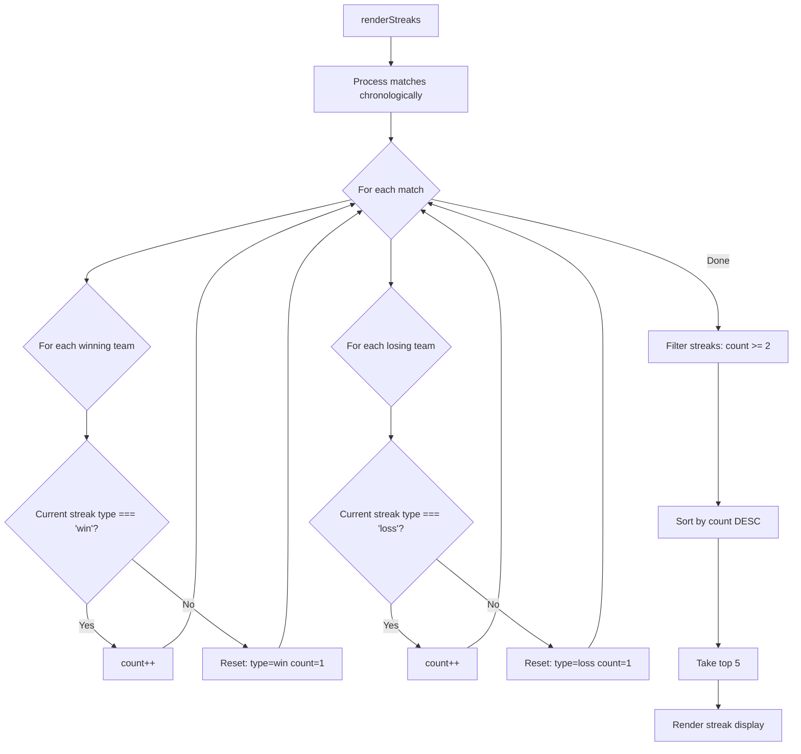
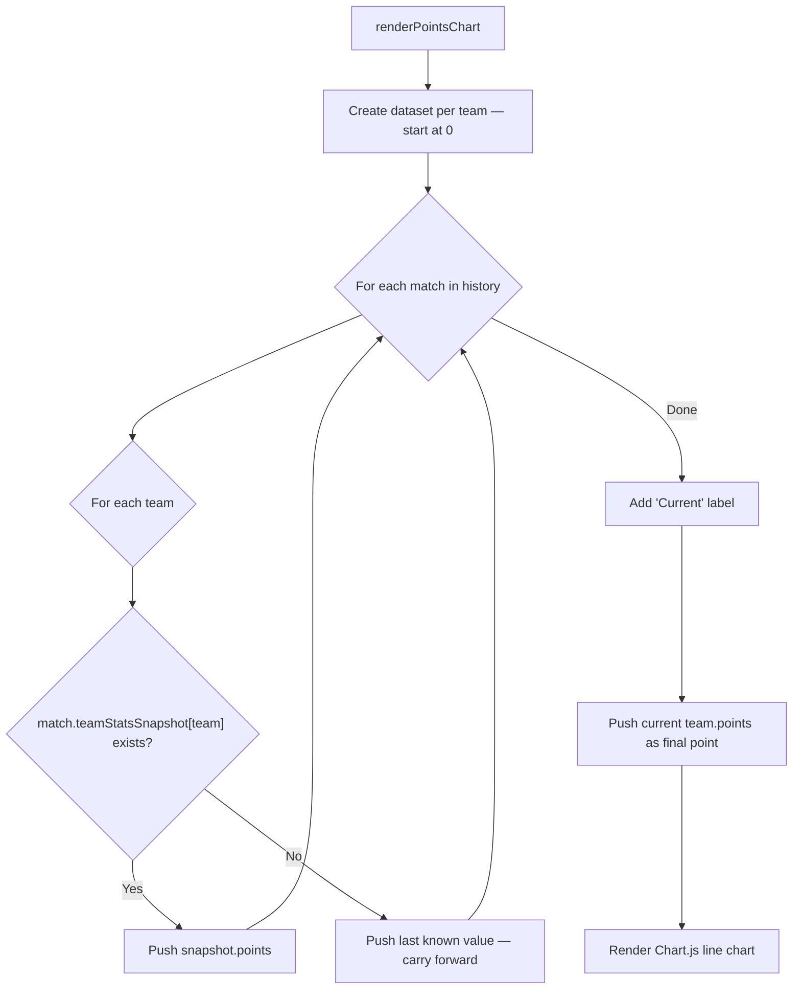
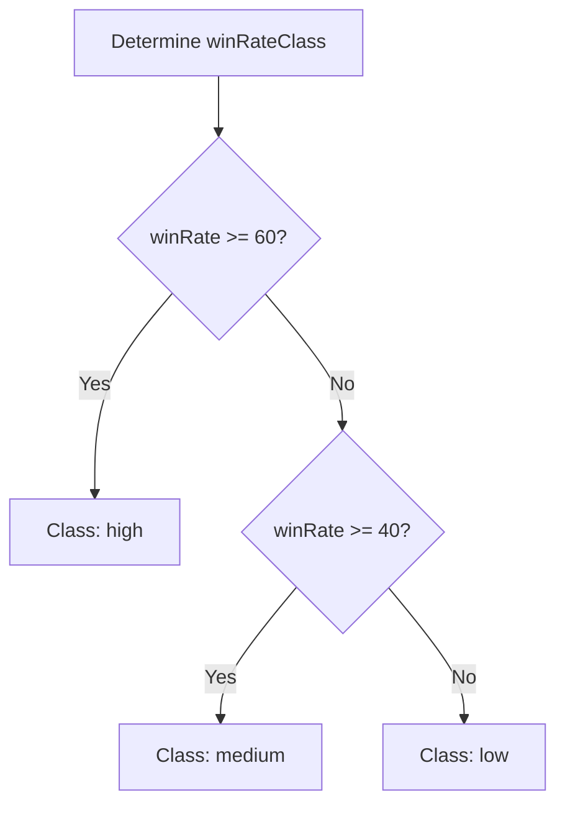
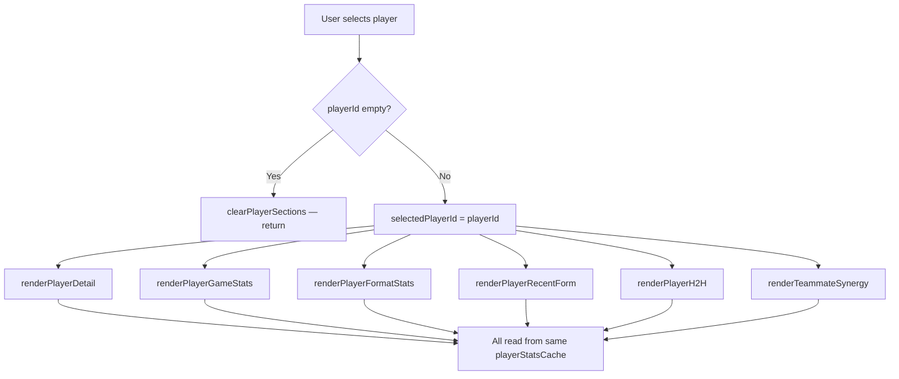

# statistics.js — Logic Diagrams

> Source: `BoardGame/lightweight/scripts/statistics.js`
> Analytics engine: leaderboards, H2H matrix, streaks, charts, player detail.
> Note: `renderSummaryStats` filters out break entries (`.filter(m => !m.isBreak)`) so breaks don't inflate match counts.

## 1. Data Loading Pipeline

## 2. Player Stats Calculation

## 3. Leaderboard Switch

## 4. Filter Matching Logic

> **Known Bug**: Result filter (`won`/`lost`) is nested inside team filter check.
> If user sets result without team, it is silently ignored.

## 5. Head-to-Head Matrix

## 6. Streaks Tracking

## 7. Points Progression Chart

## 8. Win Rate Classification

Used in 8+ places throughout the file:

## 9. Player Detail Flow

