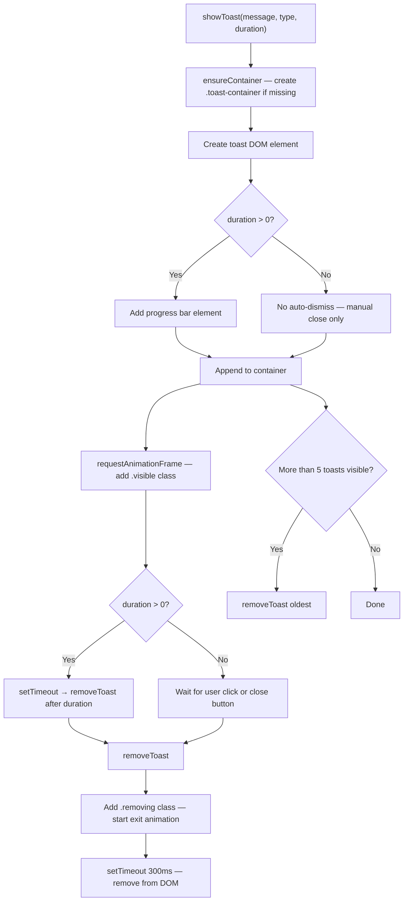
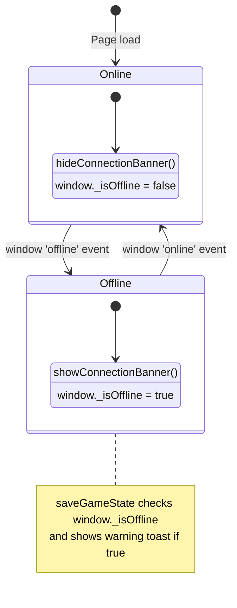
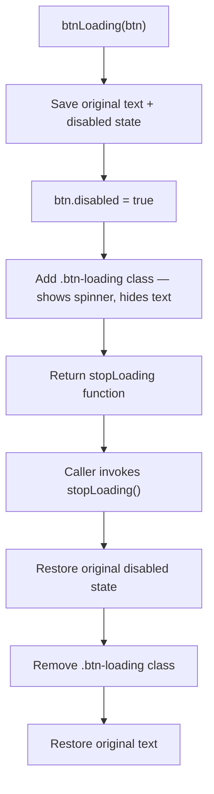

# toast.js — Logic Diagrams

> Source: `BoardGame/shared/scripts/toast.js`
> Non-blocking toast notifications, connection banner, and button loading states. Replaces browser `alert()` calls across all lightweight pages.

## 1. Toast Notification Lifecycle

## 2. Connection Banner State Machine

## 3. Button Loading State

