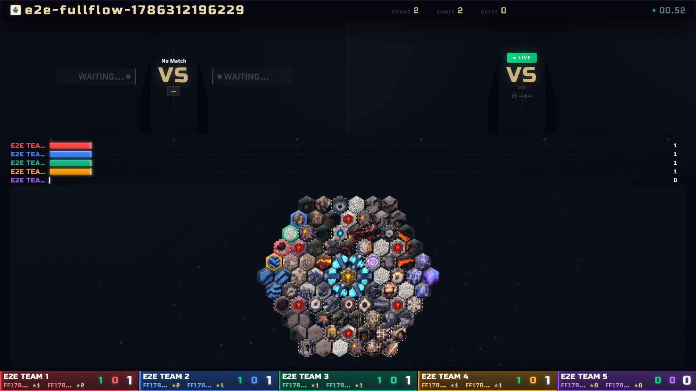
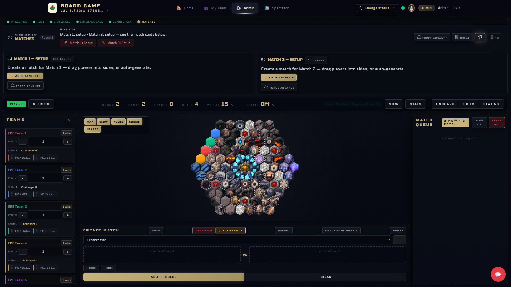
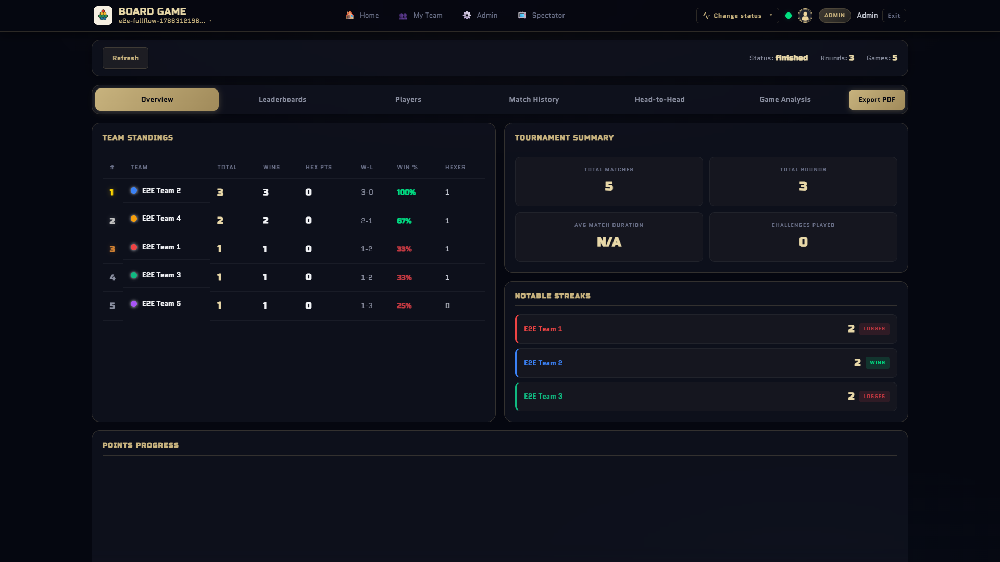
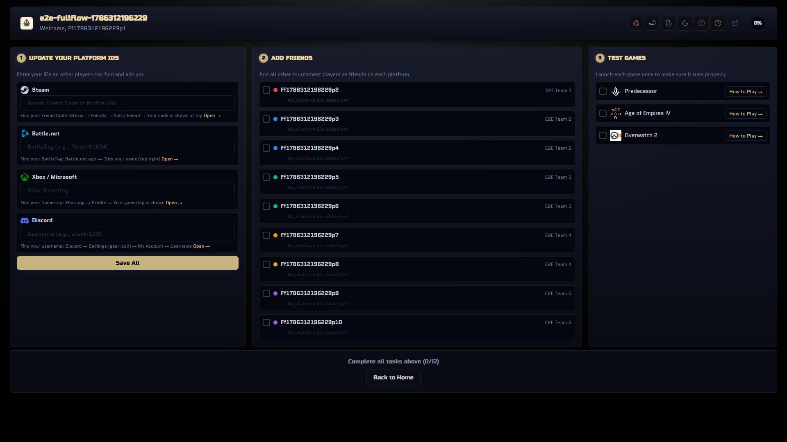
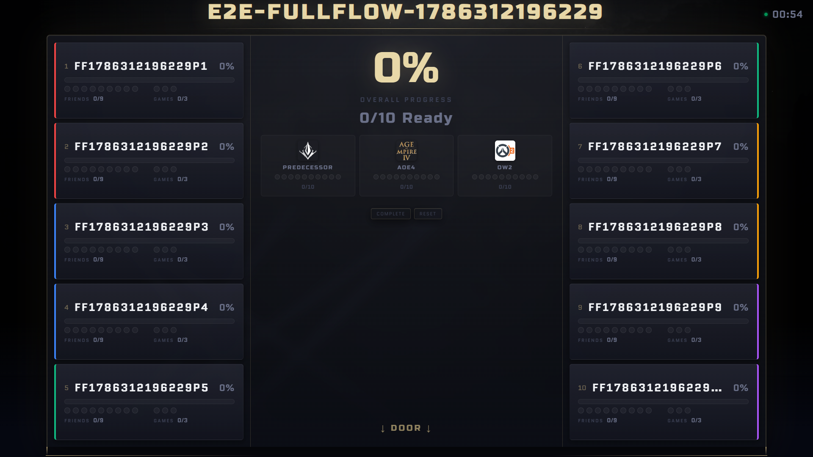
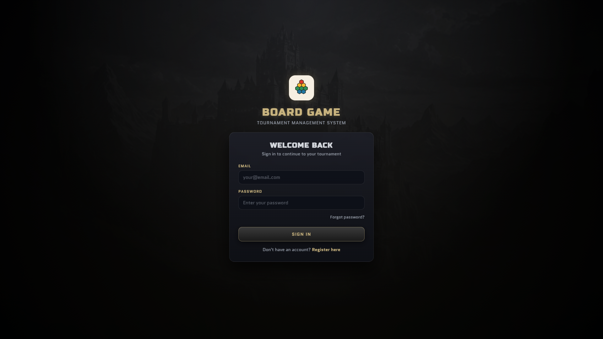

# BoardGame — Tournament Management System

> Turn your LAN party into a competitive event with a strategic board game layer.

BoardGame is a real-time tournament management system that adds a hex-grid territory control meta-game on top of competitive matches. Teams play games like CS2, Dota 2, or Valorant — and each victory earns the winning team a hex tile on a shared game board. Claim territory, control strategic heart hexes, and outscore your rivals.

Designed for LAN events. Runs in any browser. Syncs across every screen in real time.



## The Concept

At a LAN tournament, an admin queues matches from a central dashboard. Teams play their game externally (CS2, Dota 2, Valorant, Age of Empires IV, Overwatch 2, Rocket League, and more) and the admin confirms the result. The winning team then places a hex tile on a shared 91-hex game board — expanding their territory and competing for 7 strategic "heart" hexes that generate victory points. Everything updates live on every connected device.

**The board becomes the scoreboard.** Instead of a plain win/loss table, spectators watch territory shift in real time on a TV display.

## Key Features

**Tournament Control** — Create tournaments, manage teams and players, queue matches, confirm results. One admin runs the entire event from a single guided dashboard that surfaces the next action to take, with safety-rail confirmations before points are awarded or matches are started out of order.

**Smart Match Scheduling** — A built-in algorithm generates balanced matchups by minimizing variance in how often players are paired together or against each other. No manual scheduling needed.

**Hex Board Meta-Game** — A 91-hex board with 7 strategic heart hexes (6 side hearts worth 1 VP each, 1 mountain heart worth 2 VP). Winning matches lets teams expand territory and fight for control of high-value positions.

**Real-Time Sync** — Firebase-powered live updates. The admin panel, spectator board, and statistics page all reflect changes instantly across devices.

**Flexible Match Formats** — Primary formats are 5v5 and 3v3+2v2 with team-splitting mechanics, but the system supports creating matches in any format (1v1, 2v2, 2v2v2, and beyond).

**Multi-Game Support** — CS2, Dota 2, Valorant, Age of Empires IV, Overwatch 2, Rocket League, StarCraft II, and custom games. Define your own game types per tournament.

**Statistics & Export** — Win rates, player leaderboards, match history charts, and JSON export for post-event analysis.

**Discord Voice Automation** — Configurable per-slot voice channels move players into the right lobby automatically when a match starts, no manual channel-herding needed.

## How a Tournament Works

```
 Setup       →  Create tournament, add teams and players, assign seating
                ↓
 Match Loop  →  Admin queues a match (manually or via auto-scheduler)
                Teams play externally (CS2, Dota 2, Valorant, etc.)
                Admin confirms the result
                Winning team places a hex tile on the board
                Victory points update automatically
                ↓
 Repeat      →  Continue until a winner emerges or all rounds are complete
                ↓
 Post-Event  →  View statistics, export data, review match history
```

## Screenshots

| Admin Dashboard | Spectator Board | Statistics |
|:-:|:-:|:-:|
|  |  |  |
| Manage matches, teams, and the board | Live TV display (1920x1080) | Charts, leaderboards, and export |

| Player Onboarding | Room Layout | Login |
|:-:|:-:|:-:|
|  |  |  |
| Players join and get assigned | Seating arrangement overview | Authentication page |

## Use Cases

**LAN Parties & Esports Events** — Add a strategic meta-game layer that keeps every team invested between matches. The hex board creates drama and strategy beyond just winning individual games.

**Gaming Communities & Leagues** — Run recurring tournaments with built-in scheduling, statistics tracking, and fair matchmaking. Export data for season standings.

**Event Organizers** — The spectator display is designed for large screens and projectors. Real-time updates keep the audience engaged without manual scoreboard management.

## Technology

| Layer | Technology |
|-------|-----------|
| Frontend | Vanilla JavaScript (ES6+), HTML5 Canvas |
| Database | Firebase Firestore (real-time NoSQL) |
| Auth | Firebase Authentication |
| Hosting | Any static file server |

No build tools, no frameworks, no dependencies to install. Clone, configure Firebase, and serve.

## Getting Started

1. **Clone the repository**
   ```bash
   git clone https://github.com/lniitlahti/boardgame.git
   ```

2. **Set up Firebase**
   - Create a [Firebase project](https://console.firebase.google.com/) with Authentication and Firestore enabled
   - Copy `BoardGame/shared/scripts/firebase.example.js` to `firebase.js`
   - Paste your Firebase credentials into the config

3. **Serve locally**
   ```bash
   cd BoardGame
   python3 -m http.server 8080
   ```

4. **Create your first tournament**
   - Open `http://localhost:8080/login.html` and register an account
   - In Firestore, set `isAdmin: true` on your user document
   - Open the admin panel and create a tournament

For detailed instructions, see the [Setup Guide](BoardGame/docs/guides/SETUP_GUIDE.md).

## User Roles

| Role | What they can do |
|------|-----------------|
| **Admin** | Full tournament control — manage teams, queue matches, confirm results, place tiles |
| **Player** | View their team dashboard and participate in matches |
| **Spectator** | Watch the live hex board and statistics (anonymous access) |

## Project Status

This project is in **active development**, currently at **v1.0.1-alpha**. The lightweight version ran its first live LAN event successfully in February 2026 and proved the concept. Since then, a full-featured version with the OOP module stack (phases, spells, undo/backup, replay, ceremony, and player-facing pages) plus a guided admin flow has taken over as the primary version — it ran its first live LAN event in August 2026, mostly successfully, with remaining rough edges tracked in `docs/guides/EVENT_BUG_REPORTS.md`.

| Version | Status |
|---------|--------|
| Full | **The only version** — the OOP module stack with a guided admin dashboard (next-step prompts, phase gating, safety-rail confirmations) is what runs live events |
| Lightweight | Retired and removed from the repo 2026-07-31 (see git history if needed) |

## Credits

| What | Source | License |
|------|--------|---------|
| Radial status dial (navbar) | Adapted from the **Radial Dial Control Menu** by [LukyVJ](https://codepen.io/LukyVJ), itself inspired by [Josh Guo's concept](https://twitter.com/JoshGuoSpace/status/1648259938110836738) | MIT |
| Icons | [Lucide](https://lucide.dev) | ISC |
| Fonts | Russo One, Quantico (via Google Fonts) | SIL OFL 1.1 |

The status dial uses CSS `@property` and `:has()`, so it needs Chrome/Edge 115+, Safari 16.4+, or Firefox 128+. Nothing else in the app has that requirement.

## License

Free to use for non-profit purposes. For commercial use, contact the maintainer.

---

<details>
<summary><strong>Project Structure (for contributors)</strong></summary>

```
BoardGame/
├── full/                  # The game — OOP module stack + guided admin
│   ├── god.html            # Superadmin dashboard
│   ├── admin.html           # Guided tournament admin dashboard (next-step flow, safety rails)
│   ├── setup.html           # Tournament creation wizard (incl. Room Hexes step)
│   ├── view.html            # Spectator display (1920×1080)
│   ├── statistics.html      # Analytics & data export
│   ├── onboarding.html / onboarding-status.html / view-onboarding.html / view-onboarding-layout.html
│   ├── match-queue.html     # Match queue TV display
│   ├── team.html / home.html / profile.html / replay.html
│   ├── css/                 # Full-version styles (admin, onboarding, statistics, themes, etc.)
│   └── scripts/             # OOP managers (phase, board, spell, undo, backup, onboarding, etc.)
│
├── shared/                # Shared engine, config, and utilities
│   ├── scripts/           # Firebase, board engine, match scheduling, utilities
│   ├── css/               # Theme, navbar, toast notifications
│   └── images/            # Favicons, game logos, hex tiles
│
├── docs/                  # Documentation
│   ├── architecture/      # System design diagrams
│   ├── images/            # README screenshots
│   └── guides/            # Setup, testing, and reference guides
│
├── dev/                   # Dev tools & test pages
├── tools/                 # Utility tools
├── index.html             # Entry point (auth redirect)
├── login.html             # Authentication page
└── rulebook.html          # Game rules reference
```

</details>

<details>
<summary><strong>Security</strong></summary>

- Firebase credentials are excluded from version control via `.gitignore`
- Firestore Security Rules enforce all permissions server-side
- Role-based access control via user document fields
- Spectator pages use anonymous authentication (no account required to watch)
- Input sanitization via `escapeHtml()` on user-generated content

</details>

<details>
<summary><strong>Match Scheduling Algorithm</strong></summary>

The system includes two scheduling approaches:

**Rotation Pattern** — A proven 10-match cycle for 5v5 format where each team is split exactly twice per cycle, ensuring fair distribution across all team combinations.

**Balance Optimizer** — A greedy variance-minimization algorithm that tracks "with" and "against" matrices for all player pairs and selects matchups that minimize the cost function across the tournament. Supports 5v5, 3v3, and 2v2 formats.

Both approaches ensure that no team is unfairly over- or under-matched throughout the event.

</details>
